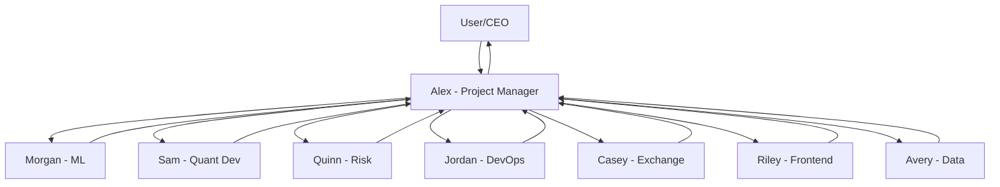

# 📢 TEAM ANNOUNCEMENT: New Command Structure

**Date**: January 12, 2025
**From**: User/CEO
**To**: All Team Members
**Subject**: Alex is Now Central Coordinator

---

## 🎯 CRITICAL CHANGE: Centralized Command Structure

Effective immediately, **Alex (Project Manager)** is the **SINGLE POINT OF COMMAND** for all team activities.

---

## 📋 What This Means

### For Alex:
- **You receive ALL tasks** from the user directly
- **You coordinate ALL team activities** 
- **You run ALL meetings** (standups, grooming, workshops)
- **You assign ALL work** to team members
- **You track ALL progress** 
- **You report ALL status** back to the user

### For All Other Team Members:
- **You receive tasks FROM Alex** (not directly from user)
- **You report status TO Alex** (who reports to user)
- **You participate in activities WHEN Alex schedules them**
- **You follow Alex's prioritization**

---

## 📅 Daily Schedule (Controlled by Alex)

| Time | Activity | Led By |
|------|----------|--------|
| 09:00 | Daily Standup | Alex |
| 09:15 | Task Assignment | Alex |
| 10:00 | Grooming Sessions (as needed) | Alex |
| 14:00 | Progress Check | Alex |
| 16:00 | Code Reviews (as scheduled) | Alex |
| 17:00 | End-of-Day Report Prep | Alex |
| 17:30 | Status Update to User | Alex |

---

## 🔄 New Workflow

---

## 📝 Key Changes

### Before:
- Tasks could come from user to any team member
- Multiple communication channels
- Decentralized coordination
- Individual status reporting

### Now:
- ALL tasks flow through Alex
- Single communication channel
- Centralized coordination
- Unified status reporting

---

## ✅ Benefits

1. **Clear accountability** - Alex owns coordination
2. **Consistent prioritization** - One source of truth
3. **Better tracking** - All work visible to Alex
4. **Reduced confusion** - Clear chain of command
5. **Efficient communication** - User talks to Alex, Alex coordinates team

---

## 🚀 Implementation

### Immediate Actions:
1. **Alex**: Take control of all ongoing tasks
2. **Alex**: Schedule next standup
3. **Team**: Report current status to Alex
4. **Team**: Wait for Alex's task assignments

### Going Forward:
- **User** will provide tasks ONLY to Alex
- **Alex** will break down and assign to team
- **Team** will execute and report to Alex
- **Alex** will aggregate and report to user

---

## 💡 Remember

- **Alex has ULTIMATE COMMAND authority**
- **Alex can override team decisions** (except Quinn's risk vetos)
- **Alex breaks deadlocks** after 3 rounds
- **Alex shields team from direct interruptions**
- **Alex ensures process is followed**

---

## 📊 Success Metrics

We will measure success by:
- Reduced task confusion
- Faster task completion
- Better coordination
- Clearer communication
- Higher team efficiency

---

## 🤝 Team Commitment

By continuing to work on this project, all team members acknowledge:
- Alex is the central coordinator
- All tasks come through Alex
- All status goes through Alex
- Alex's decisions are final (except safety vetos)

---

**This change is effective immediately.**

**Questions should be directed to Alex, who will escalate to the user if needed.**

---

*"One team, one leader, one voice to the user."*

**- Management**