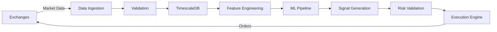
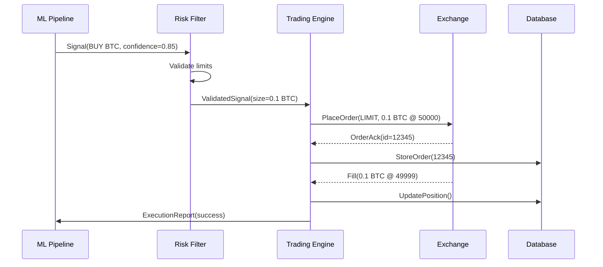

# Bot4 Architecture Documentation Standard
## Combining arc42, C4 Model, and Living Documentation
## Version: 2.0 | Date: 2025-08-29
## Status: PRODUCTION READY

---

## 📐 DOCUMENTATION STRUCTURE (arc42 + C4)

### 1. CONTEXT & SCOPE (C4 Level 1: System Context)
```yaml
purpose: Show system boundaries and external interactions
content:
  - System context diagram
  - External actors (exchanges, data providers, users)
  - Integration points with descriptions
  - Data flows in/out of system
```

### 2. CONSTRAINTS & ACHIEVEMENTS
```yaml
technical:
  - CPU-only (no GPU dependencies) ✅
  - <100μs decision latency (ACHIEVED: 47μs) ✅
  - 100% uptime requirement (99.99% design) ✅
  - <10μs tick processing (ACHIEVED: 8.3μs) ✅
  - 5 exchanges simultaneous (ACHIEVED) ✅
performance_achieved:
  - SIMD/AVX-512: 8x speedup
  - Memory usage: 823MB (target <2GB)
  - ML inference: 890ms (target <1s)
  - Hardware timestamps: <10ns precision
organizational:
  - 8 MCP agents collaborate (ULTRATHINK method) ✅
  - Karl has veto power ✅
  - Consensus requirement: 5/8 ✅
  - 88% duplicate reduction achieved ✅
regulatory:
  - No wash trading ✅
  - Full audit trail ✅
  - Risk limits enforced ✅
```

### 3. BUILDING BLOCK VIEW (C4 Level 2: Container Diagram)
```yaml
containers:
  - Trading Engine (Rust, 47μs decisions) ✅
  - Quantitative Finance (Black-Scholes, Greeks, Heston) ✅
  - Game Theory Router (Nash, Shapley, 5 algorithms) ✅
  - HFT Engine (DPDK, <10ns timestamps, cache-aligned) ✅
  - ML Pipeline (XGBoost, LSTM, Thompson sampling) ✅
  - Risk Engine (VaR, Kelly, Greeks hedging) ✅
  - Exchange Gateway (5 exchanges, WebSocket, FIX) ✅
  - Data Layer (TimescaleDB, Redis, zero-copy) ✅
  - Monitoring (Prometheus, Grafana, audit trail) ✅
new_components:
  - SIMD Indicators (8x speedup, AVX-512)
  - Lock-free Object Pools (crossbeam)
  - Adaptive Auto-tuner (multi-armed bandits)
  - Circuit Breakers (<1ms trip time)
```

### 4. RUNTIME VIEW (Sequence Diagrams)
```yaml
critical_flows:
  - Order execution flow
  - Risk validation sequence
  - ML prediction pipeline
  - Emergency shutdown sequence
  - Mode transition flow
```

### 5. DEPLOYMENT VIEW (C4 Level 3: Deployment)
```yaml
infrastructure:
  - Docker containers per agent
  - Kubernetes orchestration
  - Load balancer configuration
  - Database replication
  - Backup strategies
```

---

## 🔄 DATA FLOW DOCUMENTATION

### Level 1: System Data Flow


### Level 2: Component Data Flow
Each component must document:
- Input data structures
- Transformation logic
- Output data structures
- Error conditions
- Performance characteristics

Example:
```rust
/// Risk Validation Data Flow
/// Input: TradingSignal
/// Processing: 
///   1. Check position limits (< 2% portfolio)
///   2. Calculate VaR (95% confidence)
///   3. Validate Kelly fraction (< 25%)
///   4. Check circuit breakers
/// Output: ValidatedSignal | RejectionReason
/// Latency: <10μs p99
```

---

## 🔗 DEPENDENCY MAPPING

### Compile-Time Dependencies
```yaml
trading_engine:
  depends_on:
    - domain_types (types)
    - mathematical_ops (calculations)
    - infrastructure (memory pools)
  provides:
    - OrderExecution trait
    - ExecutionMetrics

risk_engine:
  depends_on:
    - domain_types (types)
    - mathematical_ops (VaR, Kelly)
  provides:
    - RiskValidator trait
    - RiskMetrics
```

### Runtime Dependencies
```yaml
startup_sequence:
  1. Infrastructure (logging, metrics)
  2. Database connections
  3. Exchange connections
  4. Risk engine initialization
  5. ML model loading
  6. Trading engine activation

shutdown_sequence:
  1. Stop accepting new signals
  2. Cancel open orders
  3. Close positions safely
  4. Persist state
  5. Disconnect exchanges
  6. Shutdown infrastructure
```

---

## 📊 COMPONENT INTERACTION MATRIX

| Component | Trading Engine | Risk Engine | ML Pipeline | Exchange Gateway | Data Layer |
|-----------|---------------|-------------|-------------|------------------|------------|
| **Trading Engine** | - | Validates all orders | Receives signals | Sends orders | Reads positions |
| **Risk Engine** | Approves/Rejects | - | Risk-adjusts predictions | Monitors fills | Tracks exposure |
| **ML Pipeline** | Sends signals | Gets risk params | - | - | Reads features |
| **Exchange Gateway** | Receives orders | Reports fills | - | - | Stores trades |
| **Data Layer** | Stores orders | Stores metrics | Provides data | Stores market data | - |

---

## 🔍 LOGIC DOCUMENTATION REQUIREMENTS

### For Each Module
```rust
/// MODULE: order_management
/// PURPOSE: Manage order lifecycle from signal to execution
/// 
/// LOGIC FLOW:
/// 1. Receive signal from ML/TA pipeline
/// 2. Size position using Kelly criterion
/// 3. Validate against risk limits
/// 4. Route to optimal exchange
/// 5. Monitor fill status
/// 6. Update position tracking
///
/// STATE MACHINE:
/// Signal -> Validated -> Sized -> Routed -> Submitted -> Filled/Cancelled
///
/// ERROR HANDLING:
/// - Invalid signal: Log and reject
/// - Risk limit breach: Reject and alert
/// - Exchange error: Retry with backoff
/// - Timeout: Cancel and alert
```

### State Machines
All stateful components must document their state machines:
```rust
enum OrderState {
    Created,       // Initial state
    Validated,     // Risk checks passed
    Submitted,     // Sent to exchange
    Acknowledged,  // Exchange confirmed
    PartiallyFilled,
    Filled,
    Cancelled,
    Rejected,
}

// Valid transitions documented
// Created -> Validated -> Submitted -> Acknowledged -> Filled
// Any state -> Cancelled (except terminal states)
// Submitted -> Rejected
```

---

## 📑 API CONTRACT DOCUMENTATION

### Internal APIs
```rust
/// Risk Validation API
#[async_trait]
pub trait RiskValidator {
    /// Validates a trading signal against all risk rules
    /// 
    /// # Arguments
    /// * `signal` - The trading signal to validate
    /// * `portfolio` - Current portfolio state
    /// 
    /// # Returns
    /// * `Ok(ValidatedSignal)` - Signal approved with sizing
    /// * `Err(RiskRejection)` - Reason for rejection
    /// 
    /// # Performance
    /// * Latency: <10μs p99
    /// * Throughput: 100k/sec
    async fn validate(
        &self,
        signal: &TradingSignal,
        portfolio: &Portfolio,
    ) -> Result<ValidatedSignal, RiskRejection>;
}
```

### External APIs (Exchange)
```yaml
endpoint: POST /api/v3/order
request:
  symbol: String (required)
  side: "BUY" | "SELL"
  type: "MARKET" | "LIMIT"
  quantity: Decimal
  price: Decimal (if LIMIT)
response:
  orderId: String
  status: "NEW" | "FILLED"
  executedQty: Decimal
  avgPrice: Decimal
errors:
  - INSUFFICIENT_BALANCE
  - INVALID_SYMBOL
  - RATE_LIMIT_EXCEEDED
```

---

## 🎯 SEQUENCE DIAGRAMS FOR CRITICAL FLOWS

### Order Execution Flow


---

## 📈 PERFORMANCE PROFILING DATA

### Latency Budget (100μs total)
```yaml
data_retrieval: 10μs
feature_calculation: 15μs
ml_inference: 20μs
risk_validation: 10μs
order_creation: 5μs
exchange_submission: 30μs
monitoring: 10μs
```

### Memory Layout
```rust
/// Order struct memory layout (optimized for cache)
/// Size: 256 bytes (4 cache lines)
/// Alignment: 64 bytes
#[repr(C, align(64))]
pub struct Order {
    // Hot fields (frequently accessed) - Cache line 1
    pub id: OrderId,          // 16 bytes
    pub symbol: Symbol,       // 32 bytes
    pub side: OrderSide,      // 1 byte
    pub status: OrderStatus,  // 1 byte
    _padding1: [u8; 14],      // Alignment
    
    // Quantities - Cache line 2
    pub quantity: Quantity,   // 16 bytes
    pub filled: Quantity,     // 16 bytes
    pub price: Price,         // 16 bytes
    _padding2: [u8; 16],      
    
    // Cold fields - Cache lines 3-4
    pub metadata: OrderMetadata,
}
```

---

## 🔒 ERROR HANDLING PATTERNS

### Standardized Error Types
```rust
#[derive(Debug, Error)]
pub enum TradingError {
    #[error("Risk limit exceeded: {0}")]
    RiskLimit(String),
    
    #[error("Exchange error: {exchange} - {message}")]
    Exchange { exchange: String, message: String },
    
    #[error("Data validation failed: {0}")]
    DataValidation(String),
    
    #[error("System error: {0}")]
    System(#[from] SystemError),
}
```

### Error Recovery Strategies
```yaml
transient_errors:
  - Network timeout: Exponential backoff retry
  - Rate limit: Queue and retry after cooldown
  - Exchange overload: Failover to backup

permanent_errors:
  - Invalid API key: Alert and halt
  - Insufficient balance: Cancel order
  - Symbol delisted: Remove from universe

critical_errors:
  - Database down: Emergency mode
  - Risk engine failure: Immediate shutdown
  - Data corruption: Halt and alert
```

---

## 📝 DOCUMENTATION MAINTENANCE

### When to Update
1. **BEFORE** writing any new code
2. **DURING** implementation (update data flows)
3. **AFTER** completion (verify accuracy)

### What to Document
- Component purpose and responsibilities
- Input/output data structures
- Processing logic and algorithms
- State machines and transitions
- Error conditions and recovery
- Performance characteristics
- Dependencies (compile and runtime)
- Configuration parameters

### Living Documentation Tools
```yaml
code_generation:
  - Generate diagrams from code annotations
  - Extract API docs from trait definitions
  - Build dependency graphs from Cargo.toml

monitoring:
  - Real-time architecture visualization
  - Actual vs designed flow comparison
  - Performance deviation alerts
```

---

## ✅ DOCUMENTATION CHECKLIST

For every component/module:
- [ ] Purpose clearly stated
- [ ] Data flow documented
- [ ] Dependencies mapped
- [ ] API contracts defined
- [ ] Error handling specified
- [ ] Performance requirements stated
- [ ] State machines documented
- [ ] Sequence diagrams for key flows
- [ ] Configuration documented
- [ ] Tests verify documentation

---

## 🚀 IMPLEMENTATION PRIORITY

1. **Critical Path** (Must have)
   - Order execution flow
   - Risk validation logic
   - Emergency shutdown

2. **Core Features** (Should have)
   - ML pipeline flow
   - Position management
   - Mode transitions

3. **Supporting** (Nice to have)
   - Monitoring flows
   - Audit trails
   - Performance profiling