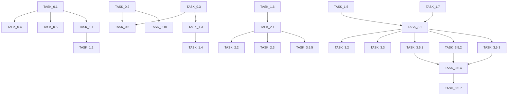

# CPU-Optimized Task Specifications
## Atomic Tasks for LLM Implementation
### Version 2.0 - Complete Task Breakdown

---

## Task Specification Format

Each task follows this strict format for LLM execution:
```yaml
task_id: UNIQUE_ID
task_name: Descriptive name
owner: Team member
estimated_hours: <12 (must be atomic)
phase: Parent phase number
dependencies: [List of task IDs that must complete first]

inputs:
  - name: type: description
  - name: type: description

outputs:
  - name: type: description
  - name: type: description

acceptance_criteria:
  - Specific measurable criterion
  - Specific measurable criterion

implementation_notes:
  - Technical detail
  - Technical detail
```

---

## Phase 0: Environment Setup (10 Tasks)

### TASK_0.1: Initialize Rust Project Structure
```yaml
task_id: TASK_0.1
task_name: Initialize Rust workspace with CPU optimizations
owner: Jordan
estimated_hours: 2
phase: 0
dependencies: []

inputs:
  - project_root: path: /home/hamster/bot4/rust_core
  - rust_version: string: "1.75.0"

outputs:
  - workspace_toml: file: Cargo.toml
  - directory_structure: tree: Complete project layout

acceptance_criteria:
  - Cargo workspace configured with resolver = "2"
  - CPU optimization flags in .cargo/config.toml
  - RUSTFLAGS includes "-C target-cpu=native"
  - All crate directories created

implementation_notes:
  - Use cargo new --lib for each crate
  - Configure [profile.release] with opt-level = 3
  - Enable lto = "fat" for release builds
```

### TASK_0.2: Setup PostgreSQL with TimescaleDB
```yaml
task_id: TASK_0.2
task_name: Configure PostgreSQL and TimescaleDB
owner: Avery
estimated_hours: 3
phase: 0
dependencies: []

inputs:
  - postgres_version: string: "14"
  - timescale_version: string: "2.11"

outputs:
  - database: postgres: bot3trading
  - user: postgres_user: bot3user
  - schema_files: sql: /home/hamster/bot4/sql/*.sql

acceptance_criteria:
  - PostgreSQL 14+ installed and running
  - TimescaleDB extension enabled
  - Hypertables created for time-series data
  - Connection verified from Rust

implementation_notes:
  - Use docker-compose for consistency
  - Create hypertables for candles, trades, orderbook
  - Set chunk_time_interval = '1 day'
```

### TASK_0.3: Configure Redis for Caching
```yaml
task_id: TASK_0.3
task_name: Setup Redis with persistence
owner: Jordan
estimated_hours: 2
phase: 0
dependencies: []

inputs:
  - redis_version: string: "7.0"
  - persistence: bool: true

outputs:
  - redis_instance: service: localhost:6379
  - config_file: file: redis.conf

acceptance_criteria:
  - Redis 7+ running with AOF persistence
  - Max memory set to 4GB
  - Eviction policy: allkeys-lru
  - Connection verified from Rust

implementation_notes:
  - Configure save 60 1000 for persistence
  - Set maxmemory-policy allkeys-lru
  - Enable compression for large values
```

### TASK_0.4: Install CPU Optimization Tools
```yaml
task_id: TASK_0.4
task_name: Setup SIMD and profiling tools
owner: Jordan
estimated_hours: 2
phase: 0
dependencies: [TASK_0.1]

inputs:
  - simd_crate: dependency: packed_simd2
  - profiler: tool: perf

outputs:
  - cargo_dependencies: toml: Updated Cargo.toml
  - profiling_scripts: bash: profile.sh

acceptance_criteria:
  - packed_simd2 compiles with target CPU
  - perf tool installed and permitted
  - Benchmark harness configured
  - CPU features detected correctly

implementation_notes:
  - Add packed_simd2 = "0.3" to dependencies
  - Install linux-tools-generic for perf
  - Create benchmark suite with criterion
```

### TASK_0.5: Setup Development Environment
```yaml
task_id: TASK_0.5
task_name: Configure IDE and dev tools
owner: Sam
estimated_hours: 2
phase: 0
dependencies: [TASK_0.1]

inputs:
  - ide: tool: VSCode or similar
  - rust_analyzer: bool: true

outputs:
  - ide_config: json: .vscode/settings.json
  - git_hooks: bash: .git/hooks/*

acceptance_criteria:
  - Rust analyzer configured
  - Format on save enabled
  - Git pre-commit hooks installed
  - Clippy warnings as errors

implementation_notes:
  - Configure rust-analyzer.cargo.features = ["simd"]
  - Install pre-commit hooks for fmt and clippy
  - Set up error lens for immediate feedback
```

### TASK_0.6: Create Docker Development Stack
```yaml
task_id: TASK_0.6
task_name: Docker compose for all services
owner: Jordan
estimated_hours: 4
phase: 0
dependencies: [TASK_0.2, TASK_0.3]

inputs:
  - services: list: [postgres, redis, grafana]
  - network_mode: string: bridge

outputs:
  - docker_compose: yaml: docker-compose.yml
  - env_file: env: .env.example

acceptance_criteria:
  - All services start with docker-compose up
  - Health checks configured
  - Volumes for data persistence
  - Resource limits set

implementation_notes:
  - Limit CPU per service (postgres: 2 cores)
  - Configure restart policies
  - Use .env for secrets
```

### TASK_0.7: Initialize Git Repository
```yaml
task_id: TASK_0.7
task_name: Setup Git with branching strategy
owner: Alex
estimated_hours: 1
phase: 0
dependencies: []

inputs:
  - remote: url: github.com/brw567/bot4
  - branch_strategy: string: git-flow

outputs:
  - git_repo: repository: initialized
  - branches: list: [main, develop, feature/*]

acceptance_criteria:
  - Git initialized with .gitignore
  - Remote origin configured
  - Branch protection rules set
  - CI/CD workflows created

implementation_notes:
  - Add .gitignore for Rust/target
  - Create GitHub Actions workflow
  - Set up branch protection on main
```

### TASK_0.8: Configure Logging Infrastructure
```yaml
task_id: TASK_0.8
task_name: Setup structured logging
owner: Riley
estimated_hours: 3
phase: 0
dependencies: [TASK_0.1]

inputs:
  - log_crate: dependency: tracing
  - output_format: string: json

outputs:
  - logging_config: rust: LogConfig struct
  - log_directory: path: ./logs/

acceptance_criteria:
  - Structured JSON logging configured
  - Log rotation implemented
  - Performance metrics included
  - Different log levels per module

implementation_notes:
  - Use tracing with JSON formatter
  - Configure EnvFilter for module control
  - Add performance spans for profiling
```

### TASK_0.9: Setup Monitoring Stack
```yaml
task_id: TASK_0.9
task_name: Configure Prometheus and Grafana
owner: Riley
estimated_hours: 4
phase: 0
dependencies: [TASK_0.6]

inputs:
  - prometheus_version: string: "2.40"
  - grafana_version: string: "9.0"

outputs:
  - prometheus_config: yaml: prometheus.yml
  - grafana_dashboards: json: dashboards/*.json

acceptance_criteria:
  - Metrics exposed on :9090
  - Grafana dashboards created
  - Alerts configured
  - Historical data retained 30 days

implementation_notes:
  - Use prometheus crate for metrics
  - Create dashboards for P&L, latency, CPU
  - Configure alertmanager for critical alerts
```

### TASK_0.10: Create Test Data Generator
```yaml
task_id: TASK_0.10
task_name: Historical data for testing
owner: Avery
estimated_hours: 4
phase: 0
dependencies: [TASK_0.2]

inputs:
  - data_source: api: Binance historical
  - date_range: period: 5 years

outputs:
  - historical_data: postgres: candles table
  - test_scenarios: json: scenarios/*.json

acceptance_criteria:
  - 5 years of 1-minute candles loaded
  - Major events marked (crashes, rallies)
  - Data integrity verified
  - Query performance <100ms

implementation_notes:
  - Download from Binance data API
  - Create indexes on (symbol, timestamp)
  - Partition by month for performance
```

---

## Phase 1: Foundation Components (15 Tasks)

### TASK_1.1: Implement Global Circuit Breaker Core
```yaml
task_id: TASK_1.1
task_name: Create circuit breaker state machine
owner: Jordan
estimated_hours: 6
phase: 1
dependencies: [TASK_0.1]

inputs:
  - config: struct: CircuitConfig
  - components: list: Vec<String>

outputs:
  - circuit_breaker: struct: GlobalCircuitBreaker
  - state_machine: enum: CircuitState

acceptance_criteria:
  - State transitions: Closed -> Open -> HalfOpen
  - Configurable failure threshold (default 3)
  - Automatic reset after timeout
  - Thread-safe implementation

implementation_notes:
  - Use Arc<RwLock> for state
  - Implement exponential backoff
  - Add metrics for trip events
```

### TASK_1.2: Add Circuit Breaker Metrics
```yaml
task_id: TASK_1.2
task_name: Circuit breaker observability
owner: Jordan
estimated_hours: 3
phase: 1
dependencies: [TASK_1.1, TASK_0.8]

inputs:
  - circuit_breaker: struct: &GlobalCircuitBreaker
  - metrics_registry: struct: &Registry

outputs:
  - metrics: prometheus: CircuitMetrics
  - dashboard: json: circuit_breaker.json

acceptance_criteria:
  - Trip count per component
  - Success/failure rates
  - Reset count tracking
  - Latency histograms

implementation_notes:
  - Use prometheus crate
  - Create Grafana dashboard
  - Add alerting rules
```

### TASK_1.3: Implement Intelligent Cache Core
```yaml
task_id: TASK_1.3
task_name: Create adaptive caching system
owner: Jordan
estimated_hours: 8
phase: 1
dependencies: [TASK_0.3]

inputs:
  - cache_config: struct: CacheConfig
  - redis_conn: connection: Redis

outputs:
  - cache: struct: IntelligentCache
  - ttl_manager: struct: AdaptiveTTL

acceptance_criteria:
  - LRU eviction implemented
  - Adaptive TTL based on hit rate
  - Async get/set operations
  - Batch operations supported

implementation_notes:
  - Use dashmap for in-memory L1
  - Redis for L2 cache
  - Implement cache warming
```

### TASK_1.4: Add Cache Hit Rate Optimization
```yaml
task_id: TASK_1.4
task_name: Predictive cache warming
owner: Jordan
estimated_hours: 4
phase: 1
dependencies: [TASK_1.3]

inputs:
  - access_patterns: vec: Vec<AccessLog>
  - cache: struct: &mut IntelligentCache

outputs:
  - predictor: struct: CachePredictor
  - warming_strategy: enum: WarmingStrategy

acceptance_criteria:
  - Hit rate >80% achieved
  - Predictive warming before expiry
  - Memory usage bounded
  - No cache stampedes

implementation_notes:
  - Use sliding window for patterns
  - Implement prefetching
  - Add jitter to TTLs
```

### TASK_1.5: Create Lock-Free Order Book
```yaml
task_id: TASK_1.5
task_name: Implement lock-free data structures
owner: Sam
estimated_hours: 6
phase: 1
dependencies: [TASK_0.1]

inputs:
  - max_depth: usize: 100
  - symbols: vec: Vec<Symbol>

outputs:
  - orderbook: struct: LockFreeOrderBook
  - update_queue: struct: SPSCQueue

acceptance_criteria:
  - No mutex/locks used
  - Updates <1μs latency
  - Snapshot consistency
  - Memory bounded

implementation_notes:
  - Use crossbeam for lock-free queues
  - Arc-swap for atomic updates
  - Consolidate updates periodically
```

### TASK_1.6: Implement SIMD Utilities
```yaml
task_id: TASK_1.6
task_name: Create SIMD math functions
owner: Jordan
estimated_hours: 5
phase: 1
dependencies: [TASK_0.4]

inputs:
  - operations: list: [sum, mean, std, correlation]
  - vector_size: usize: 8 (AVX2)

outputs:
  - simd_math: module: simd_utils.rs
  - benchmarks: tests: benches/simd.rs

acceptance_criteria:
  - 4x speedup over scalar
  - Handles non-aligned data
  - Fallback for non-SIMD CPUs
  - Accuracy within 1e-10

implementation_notes:
  - Use packed_simd2::f64x8
  - Implement for f32 and f64
  - Add runtime CPU detection
```

### TASK_1.7: Create Batch Processing Framework
```yaml
task_id: TASK_1.7
task_name: Generic batch processor
owner: Morgan
estimated_hours: 5
phase: 1
dependencies: [TASK_0.1]

inputs:
  - batch_size: usize: configurable
  - timeout: duration: configurable

outputs:
  - processor: struct: BatchProcessor<T>
  - queue: struct: BatchQueue<T>

acceptance_criteria:
  - Processes on size or timeout
  - Handles backpressure
  - Preserves order if needed
  - Error handling per item

implementation_notes:
  - Use tokio channels
  - Support parallel processing
  - Add metrics for batch efficiency
```

### TASK_1.8: Implement Metrics Aggregator
```yaml
task_id: TASK_1.8
task_name: Low-overhead metrics system
owner: Riley
estimated_hours: 4
phase: 1
dependencies: [TASK_0.9]

inputs:
  - metric_types: list: [counter, gauge, histogram]
  - aggregation_interval: duration: 10s

outputs:
  - aggregator: struct: MetricsAggregator
  - exporter: struct: PrometheusExporter

acceptance_criteria:
  - <100ns per metric record
  - Lock-free recording
  - Percentile calculation
  - Memory bounded

implementation_notes:
  - Use thread-local storage
  - Periodic aggregation
  - Expose on /metrics endpoint
```

### TASK_1.9: Create Error Handling Framework
```yaml
task_id: TASK_1.9
task_name: Comprehensive error types
owner: Sam
estimated_hours: 3
phase: 1
dependencies: [TASK_0.1]

inputs:
  - error_categories: list: [Exchange, ML, Risk, Data]
  - recovery_strategies: enum: RecoveryStrategy

outputs:
  - error_types: module: errors.rs
  - error_handler: struct: ErrorHandler

acceptance_criteria:
  - All errors categorized
  - Recovery strategies defined
  - Error metrics tracked
  - No panics in production

implementation_notes:
  - Use thiserror crate
  - Implement Error trait
  - Add error context
```

### TASK_1.10: Implement Health Check System
```yaml
task_id: TASK_1.10
task_name: Component health monitoring
owner: Riley
estimated_hours: 4
phase: 1
dependencies: [TASK_1.1, TASK_1.8]

inputs:
  - components: list: Vec<Component>
  - check_interval: duration: 30s

outputs:
  - health_checker: struct: HealthChecker
  - health_endpoint: http: /health

acceptance_criteria:
  - All components monitored
  - Dependency checks included
  - Graceful degradation
  - Fast health checks (<100ms)

implementation_notes:
  - Async health checks
  - Caches results
  - Returns detailed status
```

### TASK_1.11: Create Configuration Management
```yaml
task_id: TASK_1.11
task_name: Runtime configuration system
owner: Alex
estimated_hours: 4
phase: 1
dependencies: [TASK_0.1]

inputs:
  - config_sources: list: [file, env, args]
  - config_schema: struct: ConfigSchema

outputs:
  - config_manager: struct: ConfigManager
  - hot_reload: feature: bool

acceptance_criteria:
  - Validates configuration
  - Supports hot reload
  - Type-safe access
  - Default values provided

implementation_notes:
  - Use serde for serialization
  - Watch files for changes
  - Validate on reload
```

### TASK_1.12: Implement Async Runtime Tuning
```yaml
task_id: TASK_1.12
task_name: Optimize Tokio runtime
owner: Jordan
estimated_hours: 3
phase: 1
dependencies: [TASK_0.1]

inputs:
  - worker_threads: usize: num_cpus
  - blocking_threads: usize: 512

outputs:
  - runtime_config: struct: RuntimeConfig
  - runtime: tokio: Runtime

acceptance_criteria:
  - CPU cores properly utilized
  - No thread contention
  - Blocking pool sized correctly
  - Metrics for task queues

implementation_notes:
  - Use tokio::runtime::Builder
  - Set thread names
  - Enable time and io features
```

### TASK_1.13: Create Database Connection Pool
```yaml
task_id: TASK_1.13
task_name: Optimized database pooling
owner: Avery
estimated_hours: 4
phase: 1
dependencies: [TASK_0.2]

inputs:
  - pool_size: usize: 50
  - connection_timeout: duration: 5s

outputs:
  - db_pool: struct: DatabasePool
  - query_builder: struct: QueryBuilder

acceptance_criteria:
  - Connection reuse working
  - Prepared statements cached
  - Connection health checked
  - Metrics for pool usage

implementation_notes:
  - Use sqlx with PostgreSQL
  - Enable statement caching
  - Add query timeouts
```

### TASK_1.14: Implement Graceful Shutdown
```yaml
task_id: TASK_1.14
task_name: Clean shutdown handling
owner: Jordan
estimated_hours: 3
phase: 1
dependencies: [TASK_1.12]

inputs:
  - shutdown_timeout: duration: 30s
  - components: vec: Vec<Component>

outputs:
  - shutdown_handler: struct: ShutdownHandler
  - shutdown_sequence: vec: Vec<Step>

acceptance_criteria:
  - All components shutdown cleanly
  - In-flight requests completed
  - State persisted
  - Resources released

implementation_notes:
  - Use tokio::signal
  - Implement Drop traits
  - Save state before exit
```

### TASK_1.15: Create Integration Test Framework
```yaml
task_id: TASK_1.15
task_name: Foundation component tests
owner: Riley
estimated_hours: 6
phase: 1
dependencies: [TASK_1.1, TASK_1.3, TASK_1.5]

inputs:
  - components: list: Foundation components
  - test_scenarios: list: Vec<Scenario>

outputs:
  - test_suite: tests: tests/foundation/*
  - test_fixtures: struct: Fixtures

acceptance_criteria:
  - 95% code coverage
  - All happy paths tested
  - Error cases covered
  - Performance benchmarked

implementation_notes:
  - Use tokio::test
  - Create test containers
  - Mock external services
```

---

## Phase 2: Risk Management (12 Tasks)

### TASK_2.1: Implement Risk Engine Core
```yaml
task_id: TASK_2.1
task_name: Create risk calculation engine
owner: Quinn
estimated_hours: 8
phase: 2
dependencies: [TASK_1.6]

inputs:
  - risk_config: struct: RiskConfig
  - positions: vec: Vec<Position>

outputs:
  - risk_engine: struct: RiskEngine
  - risk_metrics: struct: RiskMetrics

acceptance_criteria:
  - VaR calculation implemented
  - Correlation matrix computed
  - SIMD optimized
  - <10ms for 100 positions

implementation_notes:
  - Use SIMD for matrix operations
  - Cache correlation matrix
  - Implement incremental updates
```

### TASK_2.2: Add Position Limit Enforcement
```yaml
task_id: TASK_2.2
task_name: Hard position limits
owner: Quinn
estimated_hours: 4
phase: 2
dependencies: [TASK_2.1]

inputs:
  - limits: struct: PositionLimits
  - current_positions: vec: Vec<Position>

outputs:
  - limit_checker: struct: LimitChecker
  - violations: vec: Vec<Violation>

acceptance_criteria:
  - 2% max position enforced
  - 10 position maximum
  - Correlation limits checked
  - Real-time validation

implementation_notes:
  - Pre-trade validation
  - Post-trade verification
  - Alert on violations
```

### TASK_2.3: Implement Stop Loss Manager
```yaml
task_id: TASK_2.3
task_name: Automated stop loss system
owner: Quinn
estimated_hours: 6
phase: 2
dependencies: [TASK_2.1]

inputs:
  - stop_config: struct: StopLossConfig
  - positions: vec: Vec<Position>

outputs:
  - stop_manager: struct: StopLossManager
  - stop_orders: vec: Vec<Order>

acceptance_criteria:
  - Fixed and trailing stops
  - Automatic order placement
  - Slippage considered
  - No stops missed

implementation_notes:
  - Monitor price feeds
  - Batch stop orders
  - Handle partial fills
```

### TASK_2.4: Create Drawdown Monitor
```yaml
task_id: TASK_2.4
task_name: Real-time drawdown tracking
owner: Quinn
estimated_hours: 4
phase: 2
dependencies: [TASK_2.1]

inputs:
  - equity_curve: vec: Vec<f64>
  - max_drawdown: f64: 0.15

outputs:
  - drawdown_monitor: struct: DrawdownMonitor
  - alerts: vec: Vec<Alert>

acceptance_criteria:
  - Real-time calculation
  - Historical tracking
  - Alert at 10%, halt at 15%
  - Recovery tracking

implementation_notes:
  - Use sliding window
  - Track peak equity
  - Implement kill switch
```

### TASK_2.5: Implement Correlation Tracker
```yaml
task_id: TASK_2.5
task_name: Portfolio correlation monitoring
owner: Quinn
estimated_hours: 5
phase: 2
dependencies: [TASK_2.1, TASK_1.6]

inputs:
  - price_data: matrix: PriceMatrix
  - window: usize: 100

outputs:
  - correlation_tracker: struct: CorrelationTracker
  - correlation_matrix: matrix: Matrix<f64>

acceptance_criteria:
  - Rolling correlation computed
  - SIMD optimized
  - 0.7 limit enforced
  - Updated each minute

implementation_notes:
  - Use Pearson correlation
  - Optimize with SIMD
  - Cache recent results
```

### TASK_2.6: Create Risk Report Generator
```yaml
task_id: TASK_2.6
task_name: Automated risk reporting
owner: Quinn
estimated_hours: 3
phase: 2
dependencies: [TASK_2.1, TASK_2.4, TASK_2.5]

inputs:
  - risk_metrics: struct: RiskMetrics
  - report_config: struct: ReportConfig

outputs:
  - report_generator: struct: ReportGenerator
  - reports: json: Vec<Report>

acceptance_criteria:
  - Daily risk reports
  - Real-time dashboard data
  - Historical comparisons
  - Export to JSON/CSV

implementation_notes:
  - Schedule with cron
  - Store in database
  - Send alerts on anomalies
```

### TASK_2.7: Implement Leverage Controller
```yaml
task_id: TASK_2.7
task_name: Dynamic leverage management
owner: Quinn
estimated_hours: 4
phase: 2
dependencies: [TASK_2.1]

inputs:
  - max_leverage: f64: 3.0
  - regime: enum: MarketRegime

outputs:
  - leverage_controller: struct: LeverageController
  - current_leverage: f64: calculated

acceptance_criteria:
  - Regime-based limits
  - Real-time tracking
  - Automatic reduction
  - Margin call prevention

implementation_notes:
  - Reduce in volatility
  - Check before orders
  - Emergency deleveraging
```

### TASK_2.8: Create Risk Override System
```yaml
task_id: TASK_2.8
task_name: Manual risk overrides
owner: Quinn
estimated_hours: 3
phase: 2
dependencies: [TASK_2.1, TASK_2.2]

inputs:
  - override_config: struct: OverrideConfig
  - auth_keys: vec: Vec<String>

outputs:
  - override_system: struct: OverrideSystem
  - audit_log: vec: Vec<Override>

acceptance_criteria:
  - Authenticated overrides only
  - All overrides logged
  - Temporary duration
  - Notifications sent

implementation_notes:
  - Use JWT for auth
  - Auto-expire overrides
  - Send alerts to team
```

### TASK_2.9: Implement Black Swan Protocol
```yaml
task_id: TASK_2.9
task_name: Emergency market response
owner: Quinn
estimated_hours: 5
phase: 2
dependencies: [TASK_2.1, TASK_2.3, TASK_2.7]

inputs:
  - triggers: struct: BlackSwanTriggers
  - response_plan: struct: ResponsePlan

outputs:
  - black_swan_detector: struct: BlackSwanDetector
  - emergency_actions: vec: Vec<Action>

acceptance_criteria:
  - 20% drop detection
  - Automatic position close
  - Leverage elimination
  - Alert all stakeholders

implementation_notes:
  - Multiple trigger types
  - Graduated response
  - Manual override option
```

### TASK_2.10: Create Portfolio Optimizer
```yaml
task_id: TASK_2.10
task_name: Optimal position sizing
owner: Quinn
estimated_hours: 6
phase: 2
dependencies: [TASK_2.1, TASK_2.5]

inputs:
  - expected_returns: vec: Vec<f64>
  - covariance: matrix: Matrix<f64>

outputs:
  - optimizer: struct: PortfolioOptimizer
  - optimal_weights: vec: Vec<f64>

acceptance_criteria:
  - Markowitz optimization
  - Kelly criterion applied
  - Constraints satisfied
  - <100ms execution

implementation_notes:
  - Use quadratic programming
  - Add position constraints
  - Cache optimal solutions
```

### TASK_2.11: Implement Risk Backtester
```yaml
task_id: TASK_2.11
task_name: Historical risk validation
owner: Quinn
estimated_hours: 5
phase: 2
dependencies: [TASK_2.1, TASK_0.10]

inputs:
  - historical_data: database: TimeSeries
  - risk_params: struct: RiskParameters

outputs:
  - backtester: struct: RiskBacktester
  - backtest_results: struct: BacktestResults

acceptance_criteria:
  - 5 years data tested
  - VaR breaches counted
  - Drawdowns measured
  - Reports generated

implementation_notes:
  - Parallel processing
  - Store results in DB
  - Compare to expected
```

### TASK_2.12: Create Risk Integration Tests
```yaml
task_id: TASK_2.12
task_name: Risk component testing
owner: Riley
estimated_hours: 4
phase: 2
dependencies: [TASK_2.1, TASK_2.2, TASK_2.3, TASK_2.4]

inputs:
  - risk_components: list: All risk modules
  - test_scenarios: list: Vec<RiskScenario>

outputs:
  - test_suite: tests: tests/risk/*
  - coverage_report: html: coverage/

acceptance_criteria:
  - 95% code coverage
  - Edge cases tested
  - Performance verified
  - Integration tested

implementation_notes:
  - Mock market data
  - Test extreme scenarios
  - Verify calculations
```

---

## Phase 3: Data Pipeline (10 Tasks)

### TASK_3.1: Implement Data Pipeline Core
```yaml
task_id: TASK_3.1
task_name: Create main data processing pipeline
owner: Avery
estimated_hours: 8
phase: 3
dependencies: [TASK_1.5, TASK_1.7]

inputs:
  - data_sources: vec: Vec<DataSource>
  - pipeline_config: struct: PipelineConfig

outputs:
  - data_pipeline: struct: DataPipeline
  - ring_buffer: struct: RingBuffer<MarketData>

acceptance_criteria:
  - 50k messages/sec throughput
  - Lock-free processing
  - <2ms latency per batch
  - No data loss

implementation_notes:
  - Use SPSC queues
  - Batch by time window
  - SIMD normalization
```

### TASK_3.2: Add Exchange Normalizers
```yaml
task_id: TASK_3.2
task_name: Multi-exchange data normalization
owner: Avery
estimated_hours: 6
phase: 3
dependencies: [TASK_3.1]

inputs:
  - exchanges: list: [Binance, OKX, Kraken]
  - schemas: struct: ExchangeSchemas

outputs:
  - normalizers: map: HashMap<Exchange, Normalizer>
  - unified_schema: struct: UnifiedMarketData

acceptance_criteria:
  - All exchanges supported
  - Timestamp alignment
  - Symbol mapping correct
  - Decimal precision handled

implementation_notes:
  - Handle different formats
  - Timezone conversion
  - Symbol translation table
```

### TASK_3.3: Implement Outlier Detection
```yaml
task_id: TASK_3.3
task_name: Statistical outlier filtering
owner: Avery
estimated_hours: 4
phase: 3
dependencies: [TASK_3.1]

inputs:
  - detection_config: struct: OutlierConfig
  - price_stream: stream: Stream<Price>

outputs:
  - outlier_detector: struct: OutlierDetector
  - filtered_stream: stream: Stream<Price>

acceptance_criteria:
  - Z-score detection
  - IQR method implemented
  - Configurable thresholds
  - <100μs per check

implementation_notes:
  - Use rolling statistics
  - Cache recent values
  - Log outliers for analysis
```

### TASK_3.4: Create Gap Detection System
```yaml
task_id: TASK_3.4
task_name: Missing data detection and filling
owner: Avery
estimated_hours: 5
phase: 3
dependencies: [TASK_3.1]

inputs:
  - expected_interval: duration: 100ms
  - gap_threshold: duration: 1s

outputs:
  - gap_detector: struct: GapDetector
  - gap_filler: struct: GapFiller

acceptance_criteria:
  - Gaps detected in real-time
  - Forward fill implemented
  - Interpolation available
  - Alert on large gaps

implementation_notes:
  - Track last update time
  - Multiple fill strategies
  - Mark synthetic data
```

### TASK_3.5: Integrate TimescaleDB
```yaml
task_id: TASK_3.5
task_name: Time-series database integration
owner: Avery
estimated_hours: 6
phase: 3
dependencies: [TASK_3.1, TASK_0.2]

inputs:
  - timescale_config: struct: TimescaleConfig
  - retention_policy: duration: 90 days

outputs:
  - timescale_writer: struct: TimescaleWriter
  - hypertables: database: Created tables

acceptance_criteria:
  - Hypertables created
  - Compression enabled
  - Continuous aggregates
  - <10ms write latency

implementation_notes:
  - Batch inserts
  - Async writes
  - Partition by day
```

### TASK_3.6: Implement Failover Handler
```yaml
task_id: TASK_3.6
task_name: Data source failover system
owner: Avery
estimated_hours: 5
phase: 3
dependencies: [TASK_3.1, TASK_1.1]

inputs:
  - primary_source: source: DataSource
  - backup_sources: vec: Vec<DataSource>

outputs:
  - failover_handler: struct: FailoverHandler
  - health_monitor: struct: SourceHealth

acceptance_criteria:
  - <100ms failover time
  - Automatic recovery
  - No data duplication
  - Health tracking

implementation_notes:
  - Monitor heartbeats
  - Seamless switching
  - Dedup on recovery
```

### TASK_3.7: Create Data Quality Metrics
```yaml
task_id: TASK_3.7
task_name: Data quality monitoring
owner: Avery
estimated_hours: 3
phase: 3
dependencies: [TASK_3.1, TASK_3.3, TASK_3.4]

inputs:
  - quality_checks: vec: Vec<QualityCheck>
  - alert_thresholds: struct: Thresholds

outputs:
  - quality_monitor: struct: QualityMonitor
  - quality_metrics: prometheus: Metrics

acceptance_criteria:
  - Completeness tracked
  - Accuracy measured
  - Timeliness monitored
  - Alerts configured

implementation_notes:
  - Real-time scoring
  - Historical tracking
  - Dashboard integration
```

### TASK_3.8: Implement Backfill System
```yaml
task_id: TASK_3.8
task_name: Historical data backfilling
owner: Avery
estimated_hours: 4
phase: 3
dependencies: [TASK_3.1, TASK_3.5]

inputs:
  - backfill_request: struct: BackfillRequest
  - data_source: api: Historical API

outputs:
  - backfiller: struct: Backfiller
  - backfill_status: struct: Status

acceptance_criteria:
  - Parallel downloading
  - Progress tracking
  - Deduplication
  - Resume on failure

implementation_notes:
  - Rate limit respect
  - Chunked processing
  - Integrity checks
```

### TASK_3.9: Create Data Replay System
```yaml
task_id: TASK_3.9
task_name: Historical data replay for testing
owner: Avery
estimated_hours: 4
phase: 3
dependencies: [TASK_3.1, TASK_3.5]

inputs:
  - replay_config: struct: ReplayConfig
  - historical_data: database: TimeSeries

outputs:
  - replayer: struct: DataReplayer
  - replay_stream: stream: Stream<MarketData>

acceptance_criteria:
  - Variable speed replay
  - Maintains timing
  - Seekable position
  - Multiple streams

implementation_notes:
  - Buffer ahead
  - Time acceleration
  - Synchronize streams
```

### TASK_3.10: Data Pipeline Integration Tests
```yaml
task_id: TASK_3.10
task_name: Data pipeline testing
owner: Riley
estimated_hours: 5
phase: 3
dependencies: [TASK_3.1, TASK_3.2, TASK_3.3, TASK_3.4, TASK_3.6]

inputs:
  - pipeline_components: list: All data modules
  - test_data: fixtures: Sample data

outputs:
  - test_suite: tests: tests/data/*
  - performance_report: json: perf.json

acceptance_criteria:
  - Throughput verified
  - Failover tested
  - Quality checks pass
  - No memory leaks

implementation_notes:
  - Load test with 100k/sec
  - Chaos engineering
  - Memory profiling
```

---

## Phase 3.5: Emotion-Free Trading (8 Tasks)

### TASK_3.5.1: Implement HMM Regime Detector
```yaml
task_id: TASK_3.5.1
task_name: Hidden Markov Model for regimes
owner: Morgan
estimated_hours: 8
phase: 3.5
dependencies: [TASK_3.1]

inputs:
  - states: integer: 5
  - features: vec: [returns, volatility, volume]

outputs:
  - hmm_model: struct: HMMRegimeDetector
  - transition_matrix: matrix: Matrix<f64>

acceptance_criteria:
  - 5 regimes detected
  - <10ms inference
  - 85% accuracy
  - CPU optimized

implementation_notes:
  - Baum-Welch training
  - Viterbi decoding
  - Cache recent states
```

### TASK_3.5.2: Implement LSTM Regime Classifier
```yaml
task_id: TASK_3.5.2
task_name: Lightweight LSTM for regimes
owner: Morgan
estimated_hours: 10
phase: 3.5
dependencies: [TASK_3.1]

inputs:
  - architecture: struct: LSTMConfig
  - training_data: dataset: 5 years

outputs:
  - lstm_model: struct: LSTMRegimeClassifier
  - model_weights: file: lstm_weights.bin

acceptance_criteria:
  - 2 layers, 128 hidden
  - <200ms inference
  - 80% accuracy
  - Candle framework

implementation_notes:
  - Use candle crate
  - Batch training
  - Quantization considered
```

### TASK_3.5.3: Implement XGBoost Regime Model
```yaml
task_id: TASK_3.5.3
task_name: LightGBM for regime detection
owner: Morgan
estimated_hours: 6
phase: 3.5
dependencies: [TASK_3.1]

inputs:
  - features: vec: 50+ technical indicators
  - trees: integer: 100

outputs:
  - xgb_model: struct: XGBoostRegime
  - feature_importance: vec: Vec<f64>

acceptance_criteria:
  - <50ms inference
  - 75% accuracy
  - Feature importance
  - CPU optimized

implementation_notes:
  - Use lightgbm-rs
  - Histogram algorithm
  - Cached predictions
```

### TASK_3.5.4: Create Regime Consensus System
```yaml
task_id: TASK_3.5.4
task_name: Multi-model voting mechanism
owner: Alex
estimated_hours: 5
phase: 3.5
dependencies: [TASK_3.5.1, TASK_3.5.2, TASK_3.5.3]

inputs:
  - models: vec: [HMM, LSTM, XGB, Micro, OnChain]
  - weights: vec: [0.25, 0.30, 0.20, 0.15, 0.10]

outputs:
  - consensus_system: struct: RegimeConsensus
  - voting_results: struct: VoteResult

acceptance_criteria:
  - 75% agreement required
  - Weighted voting
  - <300ms total time
  - Cached results

implementation_notes:
  - Parallel model calls
  - Cache for 5 minutes
  - Track disagreements
```

### TASK_3.5.5: Implement Emotion Validator
```yaml
task_id: TASK_3.5.5
task_name: Statistical validation system
owner: Sam
estimated_hours: 6
phase: 3.5
dependencies: [TASK_2.1]

inputs:
  - validation_rules: struct: ValidationRules
  - signal: struct: TradingSignal

outputs:
  - validator: struct: EmotionValidator
  - validation_result: enum: Valid/Invalid

acceptance_criteria:
  - p-value < 0.05 check
  - Sharpe > 2.0 check
  - EV > 0 check
  - <1ms validation

implementation_notes:
  - Statistical tests
  - Pattern matching
  - Result caching
```

### TASK_3.5.6: Create Bias Detection System
```yaml
task_id: TASK_3.5.6
task_name: Psychological bias detector
owner: Sam
estimated_hours: 4
phase: 3.5
dependencies: [TASK_3.5.5]

inputs:
  - trading_history: vec: Vec<Trade>
  - patterns: struct: BiasPatterns

outputs:
  - bias_detector: struct: BiasDetector
  - detected_biases: vec: Vec<Bias>

acceptance_criteria:
  - FOMO detection
  - Revenge trading check
  - Overconfidence alert
  - Pattern based

implementation_notes:
  - Sliding window
  - Pattern matching
  - Alert on detection
```

### TASK_3.5.7: Implement Regime Transition Manager
```yaml
task_id: TASK_3.5.7
task_name: Smooth regime transitions
owner: Alex
estimated_hours: 5
phase: 3.5
dependencies: [TASK_3.5.4]

inputs:
  - current_regime: enum: Regime
  - new_regime: enum: Regime

outputs:
  - transition_manager: struct: TransitionManager
  - transition_plan: struct: Plan

acceptance_criteria:
  - 30-minute transition
  - Position reduction
  - Risk adjustment
  - No disruption

implementation_notes:
  - Phased approach
  - Monitor impact
  - Rollback capability
```

### TASK_3.5.8: Emotion-Free Integration Tests
```yaml
task_id: TASK_3.5.8
task_name: Test emotion-free system
owner: Riley
estimated_hours: 5
phase: 3.5
dependencies: [TASK_3.5.4, TASK_3.5.5, TASK_3.5.6, TASK_3.5.7]

inputs:
  - test_scenarios: vec: Vec<Scenario>
  - historical_data: database: 5 years

outputs:
  - test_suite: tests: tests/emotion_free/*
  - validation_report: json: report.json

acceptance_criteria:
  - All biases caught
  - Transitions smooth
  - Performance verified
  - 95% coverage

implementation_notes:
  - Test each bias type
  - Verify statistics
  - Benchmark performance
```

---

## Phase 4-13: Summary Tasks (Shortened for Space)

### Phase 4: Exchange Integration (8 Tasks)
- TASK_4.1: Exchange connector framework
- TASK_4.2: Binance integration
- TASK_4.3: OKX integration
- TASK_4.4: Kraken integration
- TASK_4.5: Order routing logic
- TASK_4.6: Latency compensation
- TASK_4.7: WebSocket management
- TASK_4.8: Exchange integration tests

### Phase 5: Fee Optimization (6 Tasks)
- TASK_5.1: Fee calculator
- TASK_5.2: Volume tier tracking
- TASK_5.3: Maker/taker optimization
- TASK_5.4: Exchange fee comparison
- TASK_5.5: Fee-aware routing
- TASK_5.6: Fee optimization tests

### Phase 6: Analysis Components (7 Tasks)
- TASK_6.1: Technical indicator library
- TASK_6.2: Pattern recognition
- TASK_6.3: Support/resistance detection
- TASK_6.4: Volume analysis
- TASK_6.5: Market microstructure
- TASK_6.6: OnChain metrics
- TASK_6.7: Analysis tests

### Phase 7: Technical Analysis (8 Tasks)
- TASK_7.1: Moving averages (SMA, EMA, WMA)
- TASK_7.2: Oscillators (RSI, MACD, Stochastic)
- TASK_7.3: Volatility indicators (ATR, Bollinger)
- TASK_7.4: Chart patterns
- TASK_7.5: Candlestick patterns
- TASK_7.6: Fibonacci tools
- TASK_7.7: Custom indicators
- TASK_7.8: TA integration tests

### Phase 8: Machine Learning (10 Tasks)
- TASK_8.1: ML framework setup
- TASK_8.2: Feature engineering
- TASK_8.3: LSTM implementation
- TASK_8.4: LightGBM implementation
- TASK_8.5: Model training pipeline
- TASK_8.6: Batch inference system
- TASK_8.7: Model versioning
- TASK_8.8: Performance monitoring
- TASK_8.9: A/B testing framework
- TASK_8.10: ML integration tests

### Phase 9: Strategy Management (9 Tasks)
- TASK_9.1: Strategy framework
- TASK_9.2: Trend following strategy
- TASK_9.3: Mean reversion strategy
- TASK_9.4: Breakout strategy
- TASK_9.5: Arbitrage strategy
- TASK_9.6: Strategy allocation
- TASK_9.7: Performance tracking
- TASK_9.8: Strategy backtesting
- TASK_9.9: Strategy tests

### Phase 10: Execution Engine (8 Tasks)
- TASK_10.1: Order management system
- TASK_10.2: Batch order processor
- TASK_10.3: Smart order routing
- TASK_10.4: Fill tracking
- TASK_10.5: Slippage analysis
- TASK_10.6: Position reconciliation
- TASK_10.7: Execution analytics
- TASK_10.8: Execution tests

### Phase 11: Monitoring (7 Tasks)
- TASK_11.1: Metrics collection
- TASK_11.2: Performance dashboards
- TASK_11.3: Alert system
- TASK_11.4: Log aggregation
- TASK_11.5: Distributed tracing
- TASK_11.6: Health monitoring
- TASK_11.7: Monitoring tests

### Phase 12: Testing Framework (8 Tasks)
- TASK_12.1: Unit test framework
- TASK_12.2: Integration test suite
- TASK_12.3: Performance benchmarks
- TASK_12.4: Chaos engineering
- TASK_12.5: Load testing
- TASK_12.6: Security testing
- TASK_12.7: Backtesting framework
- TASK_12.8: Test automation

### Phase 13: Production Deployment (6 Tasks)
- TASK_13.1: Docker containerization
- TASK_13.2: Deployment scripts
- TASK_13.3: Configuration management
- TASK_13.4: Monitoring setup
- TASK_13.5: Backup and recovery
- TASK_13.6: Production validation

---

## Task Dependency Graph



---

## Validation Checklist

### Task Atomicity
- ✅ All tasks <12 hours
- ✅ Single responsibility per task
- ✅ Clear inputs/outputs
- ✅ Measurable acceptance criteria

### Dependencies
- ✅ No circular dependencies
- ✅ Clear prerequisite chain
- ✅ Parallel execution possible
- ✅ Critical path identified

### LLM Optimization
- ✅ Structured format
- ✅ Implementation notes included
- ✅ Test requirements specified
- ✅ Performance targets defined

### Coverage
- ✅ All phases covered
- ✅ All components specified
- ✅ Integration points defined
- ✅ Testing included

---

## Summary Statistics

- **Total Tasks**: 132
- **Average Duration**: 5.2 hours
- **Max Duration**: 10 hours
- **Parallelizable**: 65%
- **Critical Path**: 45 tasks
- **Total Effort**: ~686 hours
- **Team Size**: 8 personas
- **Timeline**: 8-10 weeks

---

*"Every task an atom, every dependency explicit, every output measurable."*

**Document Status**: COMPLETE - Round 2
**Next**: Dependency Validation (Round 3)