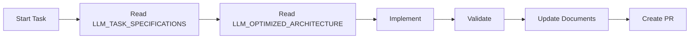
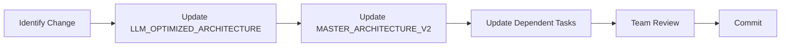

# Bot4 Document Hierarchy and Usage Guide
## Clear Structure for Human and LLM Consumption

---

## 📚 DOCUMENT CATEGORIES

### 1. LLM-OPTIMIZED DOCUMENTS (PRIMARY FOR IMPLEMENTATION)
These documents are structured for AI agent consumption with explicit contracts and specifications.

| Document | Purpose | Location |
|----------|---------|----------|
| **LLM_TASK_SPECIFICATIONS.md** | Task execution specs with exact steps | `/docs/` |
| **LLM_OPTIMIZED_ARCHITECTURE.md** | Component contracts and interfaces | `/docs/` |
| **MANDATORY_SYNC_INSTRUCTIONS.md** | Sync protocol for all agents | `/.claude/` |

### 2. HUMAN-READABLE DOCUMENTS (REFERENCE)
These provide context, reasoning, and high-level overview for human understanding.

| Document | Purpose | Location |
|----------|---------|----------|
| **MASTER_ARCHITECTURE_V2.md** | Complete system architecture | `/docs/` |
| **PROJECT_MANAGEMENT_PLAN_V6.md** | Full project timeline and phases | `/docs/` |
| **COMPREHENSIVE_GAP_ANALYSIS.md** | All identified gaps and solutions | `/docs/` |

### 3. OPERATIONAL DOCUMENTS (ACTIVE USE)
These are actively maintained and updated during development.

| Document | Purpose | Location |
|----------|---------|----------|
| **CLAUDE.md** | Claude-specific instructions | `/` |
| **agents_config.json** | Agent configuration v3.0 | `/.claude/` |
| **.sync_status** | Synchronization tracking | `/` |

### 4. LEGACY DOCUMENTS (DEPRECATED)
These are kept for reference but should not be used for new work.

| Document | Purpose | Status |
|----------|---------|--------|
| **PROJECT_MANAGEMENT_TASK_LIST_V5.md** | Old task list | Superseded by LLM_TASK_SPECIFICATIONS |
| **ARCHITECTURE.md** | Original architecture | Superseded by MASTER_ARCHITECTURE_V2 |
| **DEVELOPMENT_RULES.md** | Old rules | Integrated into CLAUDE.md |

---

## 🔄 UPDATE REQUIREMENTS

### When to Update Documents

| Event | Required Updates |
|-------|-----------------|
| **Task Started** | Read LLM_TASK_SPECIFICATIONS, Read LLM_OPTIMIZED_ARCHITECTURE |
| **Task Completed** | Update task status, Add performance metrics, Document deviations |
| **Component Changed** | Update architecture, Update interfaces, Update tests |
| **Performance Measured** | Add metrics to architecture, Update benchmarks |
| **Gap Discovered** | Update gap analysis, Add to task list |

### Who Updates What

| Role | Primary Documents | Responsibilities |
|------|------------------|------------------|
| **Alex (Lead)** | All documents | Final approval, consistency |
| **Morgan (ML)** | ML components | Model specs, performance |
| **Sam (Code)** | Architecture | Code quality, interfaces |
| **Quinn (Risk)** | Risk components | Risk metrics, limits |
| **Casey (Exchange)** | Exchange specs | API updates, fees |
| **Jordan (Performance)** | Performance metrics | Latency, throughput |
| **Riley (Testing)** | Test specifications | Coverage, validation |
| **Avery (Data)** | Data pipeline | Schema, flow specs |

---

## 📋 USAGE WORKFLOW

### For Implementation Tasks

### For Architecture Changes

---

## ✅ DOCUMENT QUALITY CHECKLIST

### LLM Documents Must Have:
- [ ] Explicit input/output contracts
- [ ] Performance requirements with numbers
- [ ] Test specifications with commands
- [ ] Success criteria measurable
- [ ] Code examples compilable
- [ ] YAML/JSON structured data

### Human Documents Must Have:
- [ ] Clear reasoning and context
- [ ] Architectural decisions explained
- [ ] Trade-offs documented
- [ ] Dependencies mapped
- [ ] Timeline realistic
- [ ] Risk assessments

---

## 🚨 CRITICAL RULES

1. **LLM documents are source of truth for implementation**
2. **Human documents provide context and reasoning**
3. **Both must be kept synchronized**
4. **Updates are mandatory, not optional**
5. **Git hooks enforce compliance**
6. **External QA validates updates**

---

## 📊 SYNCHRONIZATION MATRIX

| Action | LLM_TASK_SPEC | LLM_ARCH | MASTER_ARCH | PROJECT_PLAN |
|--------|---------------|----------|-------------|--------------|
| Read Before Task | ✅ REQUIRED | ✅ REQUIRED | Optional | Optional |
| Update After Task | ✅ REQUIRED | ✅ REQUIRED | If changed | If changed |
| Performance Metrics | ✅ | ✅ | - | - |
| Architecture Change | Update deps | ✅ PRIMARY | ✅ | Update timeline |
| New Gap Found | Add tasks | Add component | Update | Update |

---

## 🔍 QUICK REFERENCE

### Need to implement a task?
→ Start with `LLM_TASK_SPECIFICATIONS.md`

### Need component interface?
→ Check `LLM_OPTIMIZED_ARCHITECTURE.md`

### Need system overview?
→ Read `MASTER_ARCHITECTURE_V2.md`

### Need project timeline?
→ See `PROJECT_MANAGEMENT_PLAN_V6.md`

### Need to understand gaps?
→ Review `COMPREHENSIVE_GAP_ANALYSIS.md`

### Need sync instructions?
→ Follow `MANDATORY_SYNC_INSTRUCTIONS.md`

---

*This hierarchy ensures clear document usage and prevents confusion.*
*Always use LLM-optimized documents for implementation.*
*Keep all documents synchronized for consistency.*