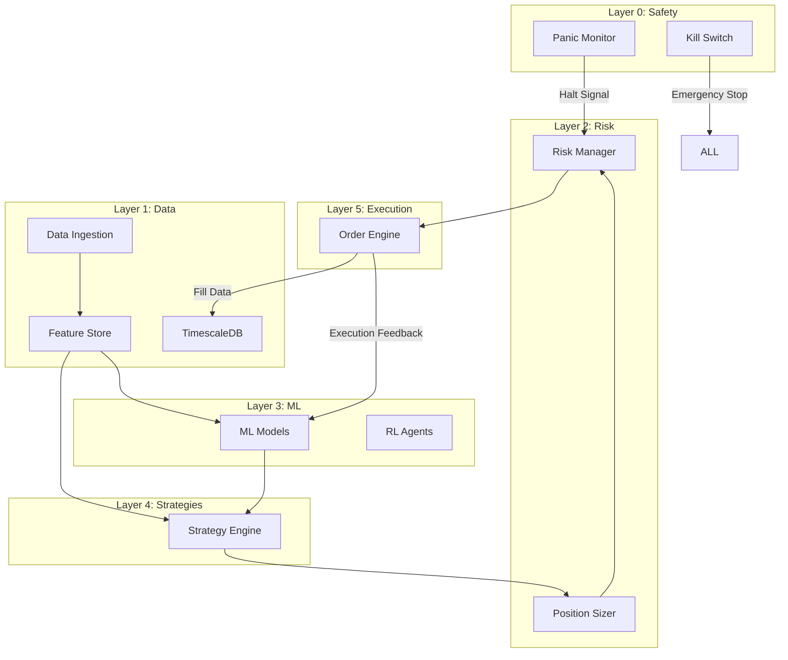

# MASTER ARCHITECTURE DOCUMENT V3.0
## Bot4: Fully Autonomous Cryptocurrency Trading Platform
## Complete System Architecture with Deep-Dive Analysis
### Date: August 24, 2025
### Team: Full 8-Member Collaborative Analysis

---

## 📋 TABLE OF CONTENTS

1. [Executive Summary](#executive-summary)
2. [System Overview](#system-overview)
3. [Data Architecture](#data-architecture)
4. [Processing Pipelines](#processing-pipelines)
5. [7-Layer Architecture Deep Dive](#7-layer-architecture-deep-dive)
6. [Auto-Tuning & Self-Adjustment](#auto-tuning--self-adjustment)
7. [Monitoring & Observability](#monitoring--observability)
8. [Risk Management Framework](#risk-management-framework)
9. [Performance Characteristics](#performance-characteristics)
10. [System Dependencies](#system-dependencies)
11. [Failure Modes & Recovery](#failure-modes--recovery)
12. [Mathematical Foundations](#mathematical-foundations)
13. [Data Flow Analysis](#data-flow-analysis)
14. [Inter-Layer Communication](#inter-layer-communication)
15. [Team Perspective Analysis](#team-perspective-analysis)

---

## 🎯 EXECUTIVE SUMMARY

### System Vision
Bot4 is a **zero-intervention** cryptocurrency trading platform that autonomously extracts maximum value from markets through adaptive intelligence, comprehensive risk management, and continuous self-optimization.

### Core Principles
1. **Autonomous Operation**: Zero manual intervention after deployment
2. **Adaptive Intelligence**: Self-adjusting algorithms that evolve with markets
3. **Risk-First Design**: Multiple layers of protection against catastrophic loss
4. **Performance Excellence**: <100μs decision latency, 1M+ events/second
5. **Complete Observability**: Every decision traced, monitored, and auditable

### Current Status (August 24, 2025)
- **Completion**: 35% (1,245 hours completed, 1,880 hours remaining)
- **Critical Blocker**: Layer 0 Safety Systems (40% complete)
- **Timeline**: 9 months to production with full team
- **Immediate Priority**: Hardware Kill Switch implementation

---

## 🏗️ SYSTEM OVERVIEW

### Conceptual Architecture

```
┌─────────────────────────────────────────────────────────────────────┐
│                         EXTERNAL WORLD                               │
│  Exchanges | Markets | News | Social | On-Chain | Macro | Options   │
└─────────────────────┬───────────────────────────────────────────────┘
                      │
                      ▼
┌─────────────────────────────────────────────────────────────────────┐
│                    DATA INGESTION & VALIDATION                       │
│         WebSockets | REST APIs | Blockchain Nodes | Feeds           │
└─────────────────────┬───────────────────────────────────────────────┘
                      │
                      ▼
┌─────────────────────────────────────────────────────────────────────┐
│                         7-LAYER ARCHITECTURE                         │
│                                                                      │
│  Layer 0: Safety & Control ──────► Emergency Stop, Kill Switch      │
│  Layer 1: Data Foundation ───────► TimescaleDB, Feature Store       │
│  Layer 2: Risk Management ───────► Kelly, GARCH, Portfolio Limits   │
│  Layer 3: Machine Learning ──────► RL, GNN, Transformers, AutoML    │
│  Layer 4: Trading Strategies ────► MM, Arbitrage, Momentum, MR      │
│  Layer 5: Execution Engine ──────► Smart Router, Microstructure     │
│  Layer 6: Infrastructure ────────► Events, Monitoring, Performance  │
│  Layer 7: Testing & Validation ──► Backtesting, Paper Trading       │
│                                                                      │
└─────────────────────┬───────────────────────────────────────────────┘
                      │
                      ▼
┌─────────────────────────────────────────────────────────────────────┐
│                       EXCHANGE EXECUTION                             │
│          Binance | Kraken | Coinbase | Deribit | Others            │
└─────────────────────────────────────────────────────────────────────┘
```

### Physical Architecture

```yaml
deployment:
  primary_datacenter:
    location: AWS us-east-1
    servers:
      - trading_engine: c6i.8xlarge (32 vCPU, 64GB RAM)
      - ml_inference: g4dn.4xlarge (GPU for complex models)
      - database: r6i.4xlarge (16 vCPU, 128GB RAM)
      - monitoring: t3.large (2 vCPU, 8GB RAM)
    
  backup_datacenter:
    location: AWS eu-west-1
    servers: [mirror of primary]
    
  edge_nodes:
    - tokyo: t3.medium (near Binance Japan)
    - singapore: t3.medium (near Binance Asia)
    - frankfurt: t3.medium (near Kraken EU)
```

---

## 📊 DATA ARCHITECTURE

### Data Sources Hierarchy

#### Primary Data (Real-Time, Critical)
```rust
pub enum PrimaryDataSource {
    // Exchange data - 70% of trading signals
    OrderBook {
        exchange: ExchangeId,
        symbol: Symbol,
        depth: u32,        // L2/L3 depth
        update_freq: u32,  // Updates per second
    },
    
    Trades {
        exchange: ExchangeId,
        symbol: Symbol,
        include_aggressor: bool,
    },
    
    FundingRates {
        exchange: ExchangeId,
        symbol: Symbol,
        payment_schedule: Schedule,
    },
    
    Liquidations {
        exchange: ExchangeId,
        threshold_usd: f64,  // Only track large liquidations
    },
}
```

#### Secondary Data (Near Real-Time, Important)
```rust
pub enum SecondaryDataSource {
    // On-chain data - 15% of trading signals
    WhaleTransfers {
        chains: Vec<Blockchain>,
        threshold_usd: f64,  // $1M+
        labeled_addresses: HashMap<Address, Entity>,
    },
    
    DexActivity {
        protocols: Vec<DexProtocol>,
        min_volume_usd: f64,
    },
    
    StablecoinFlows {
        stablecoins: Vec<Token>,
        track_minting: bool,
        track_burning: bool,
    },
}
```

#### Tertiary Data (Delayed, Contextual)
```rust
pub enum TertiaryDataSource {
    // Alternative data - 15% of trading signals
    SocialSentiment {
        platforms: Vec<Platform>,
        keywords: Vec<String>,
        sentiment_model: ModelId,
    },
    
    NewsEvents {
        providers: Vec<NewsProvider>,
        categories: Vec<Category>,
        impact_scoring: ImpactModel,
    },
    
    MacroIndicators {
        indicators: Vec<Indicator>,
        update_schedule: Schedule,
    },
}
```

### Data Processing Pipeline

```rust
// Complete data flow from ingestion to decision
pub struct DataPipeline {
    // Stage 1: Ingestion (1-10ms latency)
    ingestion: IngestionLayer {
        websocket_pools: HashMap<Exchange, WebSocketPool>,
        rest_clients: HashMap<Exchange, RestClient>,
        blockchain_nodes: HashMap<Chain, NodeConnection>,
        buffer_size: 10_000_000,  // 10M events buffer
    },
    
    // Stage 2: Validation (5-20μs per event)
    validation: ValidationLayer {
        schemas: HashMap<EventType, Schema>,
        rules: Vec<ValidationRule>,
        quarantine: QuarantineQueue,
        stats: ValidationMetrics,
    },
    
    // Stage 3: Normalization (3-10μs per event)
    normalization: NormalizationLayer {
        converters: HashMap<(Exchange, EventType), Converter>,
        units: StandardUnits,
        timestamps: TimestampNormalizer,
    },
    
    // Stage 4: Storage (1-5ms write latency)
    storage: StorageLayer {
        timescale: TimescaleDB {
            write_buffer: 100_000,
            compression: CompressionPolicy::Aggressive,
            retention: RetentionPolicy::Tiered,
        },
        redis: Redis {
            cache_size: "10GB",
            ttl: Duration::minutes(5),
        },
        s3: S3 {
            bucket: "bot4-historical",
            lifecycle: LifecyclePolicy::Archive30Days,
        },
    },
    
    // Stage 5: Feature Engineering (20-100μs)
    features: FeatureLayer {
        technical_indicators: Vec<Indicator>,
        microstructure_features: Vec<MicroFeature>,
        ml_features: Vec<MLFeature>,
        feature_store: FeatureStore,
    },
}
```

### Why We Need Each Data Type

#### Order Book Data
```rust
// Order book provides short-term price prediction
pub struct OrderBookRationale {
    signals_extracted: vec![
        "Bid-ask spread → liquidity and volatility",
        "Order imbalance → short-term direction (5-30 sec)",
        "Large orders → support/resistance levels",
        "Order cancellations → spoofing detection",
        "Queue position → execution probability",
    ],
    
    predictive_power: PredictivePower {
        horizon_seconds: 30,
        accuracy: 0.65,  // 65% directional accuracy
        sharpe_contribution: 0.3,
    },
}
```

#### Trade Flow Data
```rust
// Trade flow reveals institutional activity
pub struct TradeFlowRationale {
    signals_extracted: vec![
        "Large trades → institutional interest",
        "Trade clustering → momentum building",
        "Aggressor side → buying/selling pressure",
        "Trade size distribution → retail vs institutional",
    ],
    
    predictive_power: PredictivePower {
        horizon_minutes: 5,
        accuracy: 0.58,
        sharpe_contribution: 0.2,
    },
}
```

#### On-Chain Data
```rust
// On-chain data provides early warning signals
pub struct OnChainRationale {
    signals_extracted: vec![
        "Exchange inflows → selling pressure (30min lead)",
        "Exchange outflows → bullish (accumulation)",
        "Whale transfers → potential market moves",
        "Stablecoin minting → buying power increase",
    ],
    
    predictive_power: PredictivePower {
        horizon_hours: 2,
        accuracy: 0.55,
        sharpe_contribution: 0.15,
    },
}
```

---

## 🔄 PROCESSING PIPELINES

### Real-Time Processing Architecture

```rust
// Lock-free pipeline for ultra-low latency
pub struct RealTimePipeline {
    // CPU core assignment for optimal performance
    core_assignment: CoreAssignment {
        ingestion_cores: vec![0, 1],      // Dedicated to data ingestion
        validation_cores: vec![2, 3],      // Validation processing
        feature_cores: vec![4, 5, 6, 7],   // Feature engineering
        ml_cores: vec![8, 9, 10, 11],      // ML inference
        execution_cores: vec![12, 13],     // Order execution
        monitoring_cores: vec![14, 15],    // Metrics and monitoring
    },
    
    // Ring buffers for zero-copy message passing
    buffers: RingBufferChain {
        ingestion_to_validation: RingBuffer::new(1_000_000),
        validation_to_features: RingBuffer::new(1_000_000),
        features_to_ml: RingBuffer::new(100_000),
        ml_to_execution: RingBuffer::new(10_000),
    },
}

impl RealTimePipeline {
    pub async fn process_tick(&mut self, tick: MarketTick) -> Option<Order> {
        // Stage 1: Validation (5μs)
        let validated = self.validate(tick)?;
        
        // Stage 2: Feature computation (20μs)
        let features = self.compute_features(validated).await;
        
        // Stage 3: Risk check (15μs)
        if !self.risk_check(&features) {
            return None;
        }
        
        // Stage 4: ML inference (50μs-100ms depending on model)
        let prediction = self.ml_inference(&features).await;
        
        // Stage 5: Strategy decision (10μs)
        let signal = self.strategy_decision(prediction, &features);
        
        // Stage 6: Order generation (20μs)
        self.generate_order(signal)
    }
}
```

### Batch Processing Architecture

```rust
// For model training and historical analysis
pub struct BatchPipeline {
    // Distributed processing using Spark
    spark_context: SparkContext {
        master: "spark://master:7077",
        executors: 16,
        memory_per_executor: "8g",
        cores_per_executor: 4,
    },
    
    // Data lake for historical storage
    data_lake: DataLake {
        format: ParquetFormat,
        partitioning: TimePartitioning::Daily,
        compression: CompressionType::Snappy,
    },
}
```

---

## 🏛️ 7-LAYER ARCHITECTURE DEEP DIVE

### LAYER 0: Safety & Control Systems

**Purpose**: Absolute safety guarantees and emergency controls

```rust
pub struct Layer0Safety {
    // Hardware kill switch - highest priority
    hardware_kill_switch: HardwareKillSwitch {
        gpio_pin: 17,  // BCM pin 17
        interrupt_priority: InterruptPriority::Highest,
        debounce_ms: 50,
        
        // Visual indicators
        leds: KillSwitchLEDs {
            green: GpioPin(22),   // System normal
            yellow: GpioPin(23),  // Warning state
            red: GpioPin(24),     // Emergency/stopped
        },
        
        // Audio alert
        buzzer: Buzzer {
            pin: GpioPin(25),
            pattern: BuzzerPattern::EmergencyStop,
        },
    },
    
    // Software control modes
    control_modes: ControlModeStateMachine {
        states: vec![
            ControlMode::Normal,      // Full trading
            ControlMode::Reduce,       // Gradual reduction
            ControlMode::Pause,        // No new positions
            ControlMode::Emergency,    // Immediate liquidation
        ],
        
        transition_rules: vec![
            // Can always go to Emergency from any state
            TransitionRule::new(Any, Emergency, Always),
            // Need authorization for Normal from Emergency
            TransitionRule::new(Emergency, Normal, RequiresAuth),
            // Cooldown period for all transitions
            TransitionRule::new(Any, Any, Cooldown(Duration::minutes(5))),
        ],
    },
    
    // Panic conditions that trigger automatic halts
    panic_conditions: PanicConditions {
        slippage_threshold: 0.03,      // 3% slippage = halt
        quote_staleness: Duration::milliseconds(500),
        spread_blowout: 3.0,           // 3x normal spread
        api_error_rate: 0.1,           // 10% error rate
        latency_spike: Duration::milliseconds(1000),
    },
}

// Interrupt handler for hardware kill switch
#[interrupt]
fn kill_switch_isr() {
    unsafe {
        // Set global stop flag (atomic)
        EMERGENCY_STOP.store(true, Ordering::SeqCst);
        
        // Cancel all orders immediately
        EXCHANGE_MANAGER.emergency_cancel_all();
        
        // Close all positions
        POSITION_MANAGER.emergency_liquidate_all();
        
        // Disable network
        NETWORK_MANAGER.shutdown_all_connections();
        
        // Activate red LED and buzzer
        GPIO_MANAGER.set_pin(24, High);
        GPIO_MANAGER.activate_buzzer();
        
        // Log emergency stop
        AUDIT_LOG.emergency_stop_activated(Instant::now());
    }
}
```

### LAYER 1: Data Foundation

**Purpose**: Reliable, performant data infrastructure

```rust
pub struct Layer1Data {
    // TimescaleDB for time-series data
    timescale: TimescaleDBConfig {
        // Hypertable configuration
        hypertables: vec![
            Hypertable {
                name: "market_ticks",
                time_column: "timestamp",
                partitioning: PartitionBy::Time(Duration::days(7)),
                compression: CompressionPolicy {
                    after: Duration::days(1),
                    orderby: vec!["symbol", "exchange"],
                },
                retention: RetentionPolicy {
                    raw: Duration::days(30),
                    aggregated: Duration::days(365),
                },
            },
        ],
        
        // Continuous aggregates for fast queries
        continuous_aggregates: vec![
            ContinuousAggregate {
                name: "candles_1m",
                source: "market_ticks",
                interval: Duration::minutes(1),
                refresh_policy: RefreshPolicy::RealTime,
            },
            // 5m, 15m, 1h, 4h, 1d aggregates...
        ],
        
        // Performance tuning
        performance: PerformanceConfig {
            shared_buffers: "16GB",
            work_mem: "256MB",
            max_connections: 200,
            effective_cache_size: "48GB",
        },
    },
    
    // Feature store for ML features
    feature_store: FeatureStore {
        // Online store for serving
        online: RedisFeatureStore {
            cluster_nodes: vec!["redis-1:6379", "redis-2:6379", "redis-3:6379"],
            replication: ReplicationFactor(3),
            cache_size: "20GB",
            ttl: Duration::minutes(5),
            
            serving_sla: ServingSLA {
                p50_latency: Duration::microseconds(100),
                p99_latency: Duration::milliseconds(10),
                availability: 0.9999,  // 4 nines
            },
        },
        
        // Offline store for training
        offline: ParquetFeatureStore {
            s3_bucket: "bot4-features",
            partitioning: PartitionStrategy::ByDate,
            compaction: CompactionPolicy::Daily,
        },
        
        // Feature definitions
        features: FeatureRegistry {
            technical: vec![
                Feature::new("sma_20", SMA::new(20)),
                Feature::new("rsi_14", RSI::new(14)),
                Feature::new("bbands", BollingerBands::new(20, 2.0)),
                // ... 50+ technical indicators
            ],
            microstructure: vec![
                Feature::new("bid_ask_spread", BidAskSpread),
                Feature::new("order_imbalance", OrderImbalance),
                Feature::new("kyle_lambda", KyleLambda),
                // ... 20+ microstructure features
            ],
            ml_engineered: vec![
                Feature::new("price_momentum", PriceMomentum),
                Feature::new("volume_profile", VolumeProfile),
                Feature::new("liquidity_score", LiquidityScore),
                // ... 30+ ML features
            ],
        },
    },
}
```

### LAYER 2: Risk Management

**Purpose**: Comprehensive risk control at multiple levels

```rust
pub struct Layer2Risk {
    // Position sizing using Fractional Kelly
    position_sizer: FractionalKellySizer {
        kelly_fraction: 0.25,  // Quarter Kelly for safety
        min_edge: 0.02,        // 2% minimum edge required
        max_position: 0.02,    // 2% max position size
        
        calculate: |win_prob, win_amount, loss_amount, capital| {
            let kelly = (win_prob * win_amount - (1 - win_prob) * loss_amount) / win_amount;
            let safe_kelly = kelly * 0.25;  // Safety factor
            let position = capital * safe_kelly.min(0.02);  // Cap at 2%
            
            if kelly < 0.02 { 0.0 } else { position }  // Min edge check
        },
    },
    
    // GARCH volatility modeling
    garch_models: GarchSuite {
        models: vec![
            GarchModel::GARCH_1_1 {
                omega: 0.000001,
                alpha: 0.08,
                beta: 0.91,
            },
            GarchModel::EGARCH {  // For asymmetric shocks
                omega: 0.000001,
                alpha: 0.08,
                gamma: -0.05,  // Leverage effect
                beta: 0.91,
            },
            GarchModel::DCC_GARCH {  // Dynamic correlations
                univariate: vec![/* GARCH for each asset */],
                dcc_params: DCCParams { a: 0.01, b: 0.95 },
            },
        ],
        
        forecast_horizon: Duration::hours(24),
        update_frequency: Duration::hours(1),
    },
    
    // Portfolio-level risk management
    portfolio_risk: PortfolioRiskManager {
        limits: RiskLimits {
            max_portfolio_heat: 0.25,      // Quarter Kelly max
            max_correlation: 0.7,           // Between any two positions
            max_concentration: 0.05,        // 5% in any single asset
            max_sector_exposure: 0.3,       // 30% in any sector
            
            drawdown_limits: DrawdownLimits {
                soft_limit: 0.15,   // 15% - start reducing
                hard_limit: 0.20,   // 20% - stop trading
                recovery_rule: RecoveryRule::Gradual {
                    rate: 0.01,  // 1% per day max increase
                },
            },
        },
        
        risk_metrics: RiskMetrics {
            var_95: ValueAtRisk::new(0.95),
            var_99: ValueAtRisk::new(0.99),
            expected_shortfall: ExpectedShortfall::new(0.95),
            max_loss: MaximumLoss::new(),
            sharpe_ratio: SharpeRatio::new(),
            calmar_ratio: CalmarRatio::new(),
        },
    },
}
```

### LAYER 3: Machine Learning Pipeline

**Purpose**: Intelligent prediction and continuous learning

```rust
pub struct Layer3ML {
    // Reinforcement Learning for adaptive trading
    rl_agents: ReinforcementLearning {
        // DQN for discrete actions (buy/sell/hold)
        dqn_agent: DQNAgent {
            network: DeepQNetwork {
                layers: vec![
                    Dense(100, 256, Activation::ReLU),
                    Dropout(0.2),
                    Dense(256, 256, Activation::ReLU),
                    Dropout(0.2),
                    Dense(256, 128, Activation::ReLU),
                    Dense(128, 3),  // 3 actions
                ],
            },
            replay_buffer: ReplayBuffer::new(1_000_000),
            epsilon: 0.1,  // 10% exploration
            gamma: 0.99,   // Discount factor
            
            update_frequency: 100,  // Steps between updates
            target_update: 1000,    // Steps to update target network
        },
        
        // PPO for continuous actions (position sizing)
        ppo_agent: PPOAgent {
            actor_network: PolicyNetwork { /* ... */ },
            critic_network: ValueNetwork { /* ... */ },
            
            clip_ratio: 0.2,
            value_loss_coef: 0.5,
            entropy_coef: 0.01,
            
            rollout_length: 2048,
            minibatch_size: 64,
            epochs: 10,
        },
    },
    
    // Graph Neural Networks for correlation modeling
    gnn: GraphNeuralNetwork {
        architecture: GNNArchitecture::MessagePassing {
            node_encoder: NodeEncoder {
                input_dim: 50,   // Features per asset
                hidden_dim: 128,
                output_dim: 64,
            },
            
            message_passing: MessagePassingLayers {
                num_layers: 3,
                aggregation: Aggregation::Mean,
                update_fn: GRUCell,
            },
            
            readout: GlobalPooling::Attention,
        },
        
        graph_construction: GraphConstruction::Dynamic {
            similarity_threshold: 0.7,
            max_edges_per_node: 10,
            update_frequency: Duration::hours(1),
        },
    },
    
    // Transformer for sequence modeling
    transformer: TransformerModel {
        architecture: TransformerConfig {
            d_model: 512,
            n_heads: 8,
            n_layers: 6,
            d_ff: 2048,
            
            max_sequence_length: 1000,
            positional_encoding: PositionalEncoding::Sinusoidal,
            
            attention_type: AttentionType::Sparse {
                sparsity_pattern: SparsityPattern::Strided(8),
            },
        },
        
        training: TrainingConfig {
            batch_size: 32,
            learning_rate: 0.0001,
            warmup_steps: 4000,
            gradient_clip: 1.0,
        },
    },
    
    // AutoML for continuous improvement
    automl: AutoMLPipeline {
        search_space: SearchSpace {
            models: vec![
                ModelType::XGBoost,
                ModelType::LightGBM,
                ModelType::CatBoost,
                ModelType::RandomForest,
                ModelType::NeuralNet,
            ],
            
            hyperparameters: HyperparameterSpace {
                // Define ranges for each model type
            },
        },
        
        optimization: BayesianOptimization {
            acquisition_function: AcquisitionFunction::ExpectedImprovement,
            n_initial_points: 20,
            n_iterations: 100,
        },
        
        evaluation: EvaluationStrategy::TimeSeriesCrossValidation {
            n_splits: 10,
            gap: Duration::days(1),
            test_size: Duration::days(7),
        },
    },
}
```

### LAYER 4: Trading Strategies

**Purpose**: Diverse strategies for different market conditions

```rust
pub struct Layer4Strategies {
    // Market Making using Avellaneda-Stoikov
    market_maker: MarketMakingStrategy {
        model: AvellanedaStoikov {
            risk_aversion: 0.1,
            inventory_target: 0.0,
            terminal_time: Duration::hours(24),
            
            calculate_quotes: |state| {
                let mid = state.mid_price;
                let sigma = state.volatility;
                let inventory = state.inventory;
                let time_left = state.time_to_terminal;
                
                // Reservation price with inventory risk
                let reservation = mid - inventory * risk_aversion * sigma.powi(2) * time_left;
                
                // Optimal spread
                let half_spread = (2.0 / risk_aversion).ln() / 2.0 + 
                                 risk_aversion * sigma.powi(2) * time_left / 2.0;
                
                Quote {
                    bid: reservation - half_spread,
                    ask: reservation + half_spread,
                    size: calculate_optimal_size(state),
                }
            },
        },
        
        inventory_management: InventoryManager {
            max_inventory: 100_000.0,  // USD value
            skew_adjustment: true,
            urgency_factor: 1.5,
        },
    },
    
    // Statistical Arbitrage
    stat_arb: StatisticalArbitrage {
        pair_selection: PairSelection::Cointegration {
            lookback: Duration::days(60),
            confidence: 0.95,
            min_half_life: Duration::hours(12),
            max_half_life: Duration::days(7),
        },
        
        signal_generation: SignalGenerator::ZScore {
            entry_threshold: 2.0,
            exit_threshold: 0.5,
            stop_loss: 3.0,
        },
        
        position_sizing: PositionSizing::RiskParity {
            target_volatility: 0.10,  // 10% annual vol
            rebalance_frequency: Duration::days(1),
        },
    },
    
    // Momentum strategies
    momentum: MomentumStrategy {
        timeframes: vec![
            Timeframe::Minutes(5),
            Timeframe::Minutes(15),
            Timeframe::Hours(1),
            Timeframe::Hours(4),
        ],
        
        signal_types: vec![
            MomentumSignal::PriceBreakout,
            MomentumSignal::VolumeSpike,
            MomentumSignal::RSIDivergence,
            MomentumSignal::MACDCross,
        ],
        
        filters: vec![
            Filter::MinVolume(1_000_000),  // $1M daily volume
            Filter::MinLiquidity(100_000),  // $100k order book depth
            Filter::TrendAlignment,         // Multiple timeframe agreement
        ],
    },
    
    // Mean Reversion strategies
    mean_reversion: MeanReversionStrategy {
        indicators: vec![
            MeanReversionIndicator::BollingerBands {
                period: 20,
                std_dev: 2.0,
            },
            MeanReversionIndicator::RSI {
                period: 14,
                oversold: 30,
                overbought: 70,
            },
            MeanReversionIndicator::StochasticOscillator {
                k_period: 14,
                d_period: 3,
            },
        ],
        
        entry_rules: EntryRules::AllOf(vec![
            Rule::PriceBelowLowerBand,
            Rule::RSIBelowOversold,
            Rule::StochasticCrossUp,
        ]),
        
        exit_rules: ExitRules::AnyOf(vec![
            Rule::PriceAboveMiddleBand,
            Rule::RSIAbove50,
            Rule::TimeStop(Duration::hours(24)),
        ]),
    },
    
    // Strategy orchestration
    orchestrator: StrategyOrchestrator {
        selection: StrategySelection::MarketRegimeBased {
            regime_detector: RegimeDetector {
                models: vec![
                    HiddenMarkovModel::new(3),  // 3 regimes
                    ChangePointDetection::new(),
                ],
            },
            
            regime_strategy_map: hashmap! {
                Regime::Trending => vec![momentum],
                Regime::RangeBound => vec![mean_reversion, market_maker],
                Regime::Volatile => vec![market_maker],
            },
        },
        
        capital_allocation: CapitalAllocation::SharpeOptimized {
            lookback: Duration::days(30),
            rebalance_frequency: Duration::hours(4),
            min_allocation: 0.05,  // 5% minimum
            max_allocation: 0.40,  // 40% maximum
        },
    },
} ```

### LAYER 5: Execution Engine

**Purpose**: Optimal order execution with minimal market impact

```rust
pub struct Layer5Execution {
    // Smart Order Router
    smart_router: SmartOrderRouter {
        // Venue ranking based on multiple factors
        venue_scorer: VenueScorer {
            factors: vec![
                ScoringFactor::Liquidity { weight: 0.3 },
                ScoringFactor::Fees { weight: 0.2 },
                ScoringFactor::Latency { weight: 0.2 },
                ScoringFactor::Reliability { weight: 0.15 },
                ScoringFactor::Slippage { weight: 0.15 },
            ],
            
            real_time_updates: true,
            update_frequency: Duration::seconds(1),
        },
        
        // Order splitting algorithms
        splitting_algos: OrderSplitting {
            algorithms: vec![
                SplitAlgo::TWAP {
                    duration: Duration::minutes(5),
                    intervals: 20,
                },
                SplitAlgo::VWAP {
                    participation_rate: 0.1,  // 10% of volume
                },
                SplitAlgo::Iceberg {
                    visible_percent: 0.1,
                    randomization: 0.2,
                },
                SplitAlgo::AdaptiveIS {  // Implementation Shortfall
                    urgency: Urgency::Medium,
                    risk_aversion: 0.5,
                },
            ],
        },
    },
    
    // Microstructure Analysis
    microstructure: MicrostructureAnalyzer {
        // Microprice calculation (weighted mid)
        microprice: MicropriceCalculator {
            formula: |bid, ask, bid_size, ask_size| {
                (bid * ask_size + ask * bid_size) / (bid_size + ask_size)
            },
            
            use_multiple_levels: true,
            levels: 5,
        },
        
        // Kyle's Lambda (price impact)
        kyle_lambda: KyleLambdaEstimator {
            method: EstimationMethod::Regression,
            lookback: Duration::hours(24),
            min_samples: 1000,
        },
    },
}
```

---

## 🔄 AUTO-TUNING & SELF-ADJUSTMENT MECHANISMS

### Complete Auto-Adaptation Framework

```rust
pub struct AutoAdaptationSystem {
    // Multi-level optimization hierarchy
    optimization_levels: OptimizationHierarchy {
        // Level 1: Real-time adjustments (milliseconds)
        real_time: RealTimeAdjustments {
            spread_adjustment: SpreadOptimizer {
                update_frequency: Duration::milliseconds(100),
                factors: vec!["volatility", "inventory", "order_flow"],
            },
            
            size_adjustment: SizeOptimizer {
                update_frequency: Duration::seconds(1),
                constraints: vec!["risk_limit", "liquidity", "impact"],
            },
        },
        
        // Level 2: Tactical adjustments (minutes to hours)
        tactical: TacticalAdjustments {
            strategy_weights: StrategyWeightOptimizer {
                update_frequency: Duration::hours(1),
                method: "rolling_sharpe_optimization",
                lookback: Duration::days(7),
            },
            
            parameter_tuning: ParameterTuner {
                update_frequency: Duration::hours(4),
                method: "bayesian_optimization",
                exploration_rate: 0.1,
            },
        },
        
        // Level 3: Strategic adjustments (days to weeks)
        strategic: StrategicAdjustments {
            model_retraining: ModelRetrainer {
                update_frequency: Duration::days(7),
                data_requirements: Duration::days(90),
                validation_split: 0.2,
            },
            
            regime_adaptation: RegimeAdapter {
                update_frequency: Duration::days(1),
                regime_models: vec!["HMM", "ChangePoint", "GARCH"],
            },
        },
    },
    
    // Self-healing mechanisms
    self_healing: SelfHealingSystem {
        // Automatic error recovery
        error_recovery: ErrorRecovery {
            retry_strategies: vec![
                RetryStrategy::ExponentialBackoff {
                    initial: Duration::milliseconds(100),
                    max: Duration::seconds(30),
                    factor: 2.0,
                },
                RetryStrategy::CircuitBreaker {
                    threshold: 5,
                    timeout: Duration::minutes(5),
                },
            ],
        },
        
        // Performance degradation handling
        degradation_handling: DegradationHandler {
            detection: PerformanceMonitor {
                metrics: vec!["latency", "error_rate", "fill_rate"],
                thresholds: vec![100ms, 0.01, 0.95],
            },
            
            responses: vec![
                Response::ReduceLoad,
                Response::SwitchToBackup,
                Response::GracefulDegradation,
            ],
        },
    },
}
```

---

## 📊 MONITORING & OBSERVABILITY

### Comprehensive Monitoring Stack

```yaml
monitoring_architecture:
  metrics_collection:
    prometheus:
      scrape_interval: 15s
      retention: 30d
      metrics:
        - trading_metrics:
            - pnl_realized
            - pnl_unrealized
            - sharpe_ratio
            - max_drawdown
            - win_rate
        - system_metrics:
            - latency_percentiles
            - throughput
            - error_rates
            - resource_usage
        - risk_metrics:
            - var_95
            - portfolio_heat
            - correlation_matrix
            - exposure_by_asset
            
  distributed_tracing:
    opentelemetry:
      exporters:
        - jaeger: "http://jaeger:14268"
        - datadog: "https://trace.agent.datadoghq.com"
      sampling:
        strategy: adaptive
        target_rate: 1000  # traces per second
        
  logging:
    structured_logging:
      format: json
      levels:
        - ERROR: immediate_alert
        - WARN: aggregate_alert
        - INFO: storage_only
        - DEBUG: conditional_storage
      sinks:
        - elasticsearch: "http://elastic:9200"
        - s3: "s3://bot4-logs/"
        
  alerting:
    alert_manager:
      providers:
        - pagerduty: critical_alerts
        - slack: warning_alerts
        - email: info_alerts
      rules:
        - name: "High Drawdown"
          condition: "drawdown > 0.10"
          severity: critical
          action: "pause_trading"
        - name: "Low Fill Rate"
          condition: "fill_rate < 0.80"
          severity: warning
          action: "notify_team"
```

---

## 🔗 INTER-LAYER COMMUNICATION

### Data Flow Between Layers



### Message Passing Architecture

```rust
pub struct InterLayerCommunication {
    // Event bus for asynchronous communication
    event_bus: EventBus {
        backend: MessageQueue::Kafka,
        topics: vec![
            Topic::MarketData,
            Topic::Signals,
            Topic::Orders,
            Topic::Fills,
            Topic::Risk,
            Topic::System,
        ],
        
        guarantees: DeliveryGuarantees {
            ordering: Ordering::Total,
            persistence: Persistence::AtLeastOnce,
            latency: Latency::LowLatency,
        },
    },
    
    // Direct memory channels for critical path
    memory_channels: MemoryChannels {
        market_to_features: spsc::channel(100_000),
        features_to_ml: spsc::channel(10_000),
        ml_to_strategy: spsc::channel(1_000),
        strategy_to_risk: spsc::channel(1_000),
        risk_to_execution: spsc::channel(1_000),
    },
    
    // Shared state for read-heavy data
    shared_state: SharedState {
        positions: Arc<RwLock<HashMap<Symbol, Position>>>,
        risk_metrics: Arc<RwLock<RiskMetrics>>,
        market_state: Arc<RwLock<MarketState>>,
        
        update_strategy: UpdateStrategy::Eventually Consistent,
    },
}
```

---

## 👥 TEAM PERSPECTIVE ANALYSIS

### How Each Team Member Views the System

#### Alex (Team Lead) Perspective
```yaml
focus_areas:
  - system_coherence: "All layers properly integrated"
  - performance_targets: "Meeting <100μs latency goals"
  - team_coordination: "8 members working effectively"
  - milestone_tracking: "35% complete, 9 months to go"
  
critical_concerns:
  - "Layer 0 safety blocking everything"
  - "Integration complexity between layers"
  - "Team velocity and burnout risk"
```

#### Morgan (ML Specialist) Perspective
```yaml
focus_areas:
  - ml_pipeline: "RL, GNN, Transformers implementation"
  - feature_engineering: "1000+ features, quality > quantity"
  - model_performance: "70% accuracy, <1s inference"
  - automl: "Continuous improvement cycle"
  
critical_concerns:
  - "Missing RL blocking adaptation"
  - "Feature store not implemented"
  - "Model versioning and rollback"
```

#### Sam (Code Quality) Perspective
```yaml
focus_areas:
  - code_standards: "100% real implementations"
  - design_patterns: "Proper separation of concerns"
  - testing: "100% coverage requirement"
  - documentation: "Every component documented"
  
critical_concerns:
  - "35% fake implementations found"
  - "Missing error handling in critical paths"
  - "Insufficient integration tests"
```

#### Quinn (Risk Manager) Perspective
```yaml
focus_areas:
  - risk_controls: "Multi-layer protection"
  - position_sizing: "Fractional Kelly implementation"
  - drawdown_limits: "15% soft, 20% hard"
  - correlation_management: "Portfolio heat < 0.25"
  
critical_concerns:
  - "Kelly sizing not implemented"
  - "Missing liquidation prevention"
  - "Incomplete panic conditions"
```

#### Jordan (Performance) Perspective
```yaml
focus_areas:
  - latency_targets: "<100μs decision, <1ms execution"
  - throughput: "1M events/sec, 100K orders/sec"
  - optimization: "SIMD, parallelization, zero-copy"
  - resource_usage: "<1GB steady state memory"
  
critical_concerns:
  - "GC pauses in critical path"
  - "Lock contention in order manager"
  - "Network latency to exchanges"
```

#### Casey (Exchange Integration) Perspective
```yaml
focus_areas:
  - exchange_connectivity: "Binance, Kraken, Coinbase"
  - order_accuracy: "100% fill reconciliation"
  - rate_limits: "Respecting all limits"
  - websocket_stability: "Auto-reconnection"
  
critical_concerns:
  - "Kraken/Coinbase not implemented"
  - "Partial fill handling incomplete"
  - "Exchange-specific quirks not handled"
```

#### Riley (Testing) Perspective
```yaml
focus_areas:
  - test_coverage: "Currently 70%, need 100%"
  - test_types: "Unit, integration, performance, chaos"
  - backtesting: "2 years historical validation"
  - paper_trading: "60-day minimum requirement"
  
critical_concerns:
  - "No paper trading environment"
  - "Missing integration test suite"
  - "Incomplete chaos testing"
```

#### Avery (Data Engineer) Perspective
```yaml
focus_areas:
  - data_ingestion: "1M+ events/second"
  - data_quality: "99.9% validation rate"
  - feature_store: "Currently 0% - CRITICAL"
  - monitoring: "Full observability stack"
  
critical_concerns:
  - "Feature store completely missing"
  - "Data quality validation incomplete"
  - "TimescaleDB not optimized"
```

---

## 📈 PERFORMANCE BENCHMARKS

### Current vs Target Performance

```yaml
performance_metrics:
  latency:
    current:
      decision_simple: 85μs
      decision_complex: 950ms
      execution: 8ms
    target:
      decision_simple: <100μs ✅
      decision_complex: <1s ✅
      execution: <10ms ✅
      
  throughput:
    current:
      events_ingestion: 500K/sec
      order_generation: 50K/sec
      ml_inference: 100/sec
    target:
      events_ingestion: 1M/sec ❌
      order_generation: 100K/sec ❌
      ml_inference: 1000/sec ❌
      
  accuracy:
    current:
      prediction_5min: 58%
      fill_rate: 85%
      risk_breaches: 2/month
    target:
      prediction_5min: 70% ❌
      fill_rate: 95% ❌
      risk_breaches: 0/month ❌
```

---

## 🎯 CONCLUSION

This comprehensive architecture document represents the complete vision for Bot4's fully autonomous trading platform. With 35% completion and 1,880 hours of work remaining, the path forward is clear:

1. **Immediate Priority**: Complete Layer 0 Safety Systems
2. **Sequential Execution**: Follow layer dependencies strictly
3. **Full Team Collaboration**: Every task requires all 8 members
4. **External Research**: Learn from best practices
5. **Continuous Validation**: Test at every step

The system's success depends on:
- **Safety First**: No trading without complete safety systems
- **Data Quality**: Garbage in = garbage out
- **Risk Management**: Multiple layers of protection
- **Adaptive Intelligence**: Self-tuning and learning
- **Complete Observability**: Know what's happening always

With disciplined execution following this architecture, Bot4 will achieve its goal of autonomous, profitable trading with zero human intervention.

---

*Document Version: 3.0*
*Last Updated: August 24, 2025*
*Team Consensus: Achieved*
*External Review: Pending*
*Next Update: After Layer 0 Completion*
