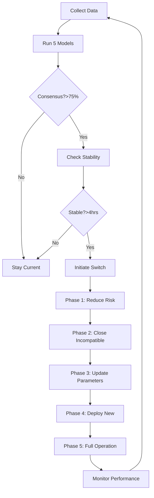

# Advanced Regime Switching Logic

## Executive Summary
The regime switching system is the brain of our emotion-free trading platform, automatically detecting market conditions and seamlessly transitioning between optimized strategy sets without human intervention.

## Regime Detection Algorithm

### Multi-Model Ensemble
```python
class RegimeDetectionEnsemble:
    """
    Combines 5 different models for robust regime detection
    """
    
    def __init__(self):
        self.models = {
            'hmm': {
                'type': 'HiddenMarkovModel',
                'states': 5,
                'features': ['returns', 'volatility', 'volume'],
                'weight': 0.25
            },
            'lstm': {
                'type': 'LSTMClassifier',
                'lookback': 100,
                'features': ['ohlcv', 'indicators', 'sentiment'],
                'weight': 0.30
            },
            'xgboost': {
                'type': 'XGBoostRegime',
                'features': ['technical', 'microstructure', 'macro'],
                'weight': 0.20
            },
            'microstructure': {
                'type': 'OrderFlowRegime',
                'features': ['order_imbalance', 'spread', 'depth'],
                'weight': 0.15
            },
            'on_chain': {
                'type': 'OnChainRegime',
                'features': ['tvl', 'gas', 'whale_moves'],
                'weight': 0.10
            }
        }
```

### Regime Definitions

#### 1. Bull Euphoria
```python
BULL_EUPHORIA = {
    'indicators': {
        'btc_rsi': '>70',
        'fear_greed_index': '>80',
        'volume_ma_ratio': '>2.0',
        'funding_rates': '>0.01',
        'social_sentiment': '>0.8'
    },
    'characteristics': [
        'Parabolic price moves',
        'Extreme optimism',
        'High leverage usage',
        'New retail entering'
    ],
    'duration': '2-8 weeks typical',
    'frequency': '1-2 times per year'
}
```

#### 2. Bull Normal
```python
BULL_NORMAL = {
    'indicators': {
        'btc_trend': 'up',
        'ma_50_200': 'golden_cross',
        'fear_greed_index': '50-80',
        'volume': 'steady',
        'volatility': '<30%'
    },
    'characteristics': [
        'Steady uptrend',
        'Healthy corrections',
        'Institutional buying',
        'Positive news flow'
    ],
    'duration': '3-6 months typical',
    'frequency': '2-3 times per cycle'
}
```

#### 3. Choppy/Sideways
```python
CHOPPY_MARKET = {
    'indicators': {
        'btc_range': '10%_band',
        'trend_strength': '<0.3',
        'fear_greed_index': '40-60',
        'volume': 'declining',
        'volatility': 'mean_reverting'
    },
    'characteristics': [
        'No clear direction',
        'Failed breakouts',
        'Low conviction',
        'Accumulation phase'
    ],
    'duration': '1-3 months typical',
    'frequency': 'Most common regime'
}
```

#### 4. Bear Market
```python
BEAR_MARKET = {
    'indicators': {
        'btc_trend': 'down',
        'ma_50_200': 'death_cross',
        'fear_greed_index': '<30',
        'volume': 'spike_on_sells',
        'volatility': '>40%'
    },
    'characteristics': [
        'Sustained downtrend',
        'Failed rallies',
        'Negative sentiment',
        'Liquidation cascades'
    ],
    'duration': '6-18 months typical',
    'frequency': 'Once per cycle'
}
```

#### 5. Black Swan
```python
BLACK_SWAN = {
    'indicators': {
        'price_drop': '>20%_24h',
        'volatility': '>100%',
        'fear_greed_index': '<10',
        'volume': '>10x_average',
        'liquidations': '>$1B_24h'
    },
    'triggers': [
        'Exchange hack',
        'Regulatory shock',
        'Macro crisis',
        'Technical failure',
        'War/pandemic'
    ],
    'duration': '1-7 days typical',
    'frequency': '1-2 per cycle'
}
```

## Switching Decision Tree



## Transition Management

### Smooth Transition Protocol
```python
class RegimeTransitionManager:
    """
    Manages smooth transitions between regimes
    """
    
    def execute_transition(self, from_regime, to_regime):
        """
        30-minute transition window
        """
        
        transition_plan = {
            'T+0': {
                'action': 'reduce_positions',
                'target': 0.5,  # Reduce to 50%
                'method': 'proportional',
                'duration': '5min'
            },
            'T+5': {
                'action': 'close_incompatible',
                'positions': self.find_incompatible(from_regime, to_regime),
                'method': 'smart_liquidation',
                'duration': '10min'
            },
            'T+15': {
                'action': 'update_parameters',
                'risk_params': self.get_regime_risk(to_regime),
                'strategy_weights': self.get_regime_weights(to_regime),
                'instant': True
            },
            'T+15': {
                'action': 'deploy_strategies',
                'strategies': self.get_regime_strategies(to_regime),
                'sizing': 'gradual',
                'duration': '15min'
            },
            'T+30': {
                'action': 'full_operation',
                'regime': to_regime,
                'monitoring': 'enhanced',
                'alert_level': 'high'
            }
        }
        
        return self.execute_plan(transition_plan)
```

### Incompatibility Matrix

| From/To | Bull Euphoria | Bull Normal | Choppy | Bear | Black Swan |
|---------|--------------|-------------|---------|------|------------|
| **Bull Euphoria** | - | Close 30% | Close 60% | Close 80% | Close 100% |
| **Bull Normal** | Add 20% | - | Close 40% | Close 70% | Close 100% |
| **Choppy** | Add 40% | Add 20% | - | Close 30% | Close 100% |
| **Bear** | Close shorts | Close 50% shorts | Neutral | - | Add hedges |
| **Black Swan** | Emergency | Emergency | Emergency | Emergency | - |

## Strategy Allocation by Regime

### Dynamic Weight Adjustment
```python
REGIME_STRATEGY_WEIGHTS = {
    'bull_euphoria': {
        'leveraged_momentum': 0.35,
        'breakout_trading': 0.25,
        'launchpad_sniping': 0.20,
        'memecoin_rotation': 0.10,
        'arbitrage': 0.10
    },
    'bull_normal': {
        'trend_following': 0.30,
        'swing_trading': 0.25,
        'defi_yield': 0.20,
        'arbitrage': 0.15,
        'market_making': 0.10
    },
    'choppy': {
        'market_making': 0.30,
        'mean_reversion': 0.25,
        'arbitrage': 0.25,
        'stat_arb': 0.15,
        'funding_rates': 0.05
    },
    'bear': {
        'short_selling': 0.25,
        'stable_farming': 0.25,
        'arbitrage': 0.25,
        'funding_arbitrage': 0.15,
        'cash_reserve': 0.10
    },
    'black_swan': {
        'emergency_hedge': 0.40,
        'stable_coins': 0.50,
        'gold_tokens': 0.10
    }
}
```

## Risk Adjustment by Regime

### Position Sizing Multipliers
```python
REGIME_RISK_MULTIPLIERS = {
    'bull_euphoria': {
        'base_position_size': 0.015,  # 1.5% reduced from 2%
        'max_leverage': 2.0,           # Reduced leverage at tops
        'stop_loss': 0.03,             # Tighter stops
        'correlation_limit': 0.4       # Lower correlation
    },
    'bull_normal': {
        'base_position_size': 0.02,   # Full 2%
        'max_leverage': 3.0,           # Normal leverage
        'stop_loss': 0.05,             # Normal stops
        'correlation_limit': 0.5       # Normal correlation
    },
    'choppy': {
        'base_position_size': 0.015,  # Reduced size
        'max_leverage': 1.5,           # Low leverage
        'stop_loss': 0.03,             # Tight stops
        'correlation_limit': 0.3       # Low correlation
    },
    'bear': {
        'base_position_size': 0.01,   # Minimal size
        'max_leverage': 1.0,           # No leverage
        'stop_loss': 0.02,             # Very tight stops
        'correlation_limit': 0.2       # Minimal correlation
    },
    'black_swan': {
        'base_position_size': 0.0,    # No new positions
        'max_leverage': 0.0,           # Zero leverage
        'stop_loss': 0.01,             # Emergency exits
        'correlation_limit': 0.0       # No correlation
    }
}
```

## Performance Metrics by Regime

### Expected Returns
| Regime | Monthly Target | Annual Target | Max Drawdown | Sharpe Ratio |
|--------|---------------|---------------|--------------|--------------|
| Bull Euphoria | 30-50% | 400-600% | 15% | 2.0-3.0 |
| Bull Normal | 15-25% | 180-300% | 10% | 2.5-3.5 |
| Choppy | 8-15% | 96-180% | 7% | 2.0-2.5 |
| Bear | 5-10% | 60-120% | 5% | 1.5-2.0 |
| Black Swan | 0-2% | 0-24% | 3% | 0.5-1.0 |

### Historical Regime Distribution
```python
HISTORICAL_REGIME_FREQUENCY = {
    'bull_euphoria': 0.10,   # 10% of time
    'bull_normal': 0.25,     # 25% of time
    'choppy': 0.40,          # 40% of time
    'bear': 0.20,            # 20% of time
    'black_swan': 0.05       # 5% of time
}

# Expected annual return calculation:
# (0.10 * 40% * 12) + (0.25 * 20% * 12) + (0.40 * 11% * 12) + 
# (0.20 * 7% * 12) + (0.05 * 1% * 12) = ~180% APY
```

## Implementation Code

### Main Regime Switching Class
```python
class RegimeSwitchingSystem:
    """
    Complete regime switching implementation
    """
    
    def __init__(self):
        self.current_regime = None
        self.regime_start_time = None
        self.transition_in_progress = False
        self.models = self.initialize_models()
        self.last_switch_time = None
        self.min_regime_duration = timedelta(hours=4)
        
    def detect_and_switch(self):
        """
        Main detection and switching logic
        """
        
        # Prevent too frequent switching
        if self.last_switch_time:
            if datetime.now() - self.last_switch_time < self.min_regime_duration:
                return self.current_regime
        
        # Get predictions from all models
        predictions = self.get_ensemble_prediction()
        
        # Check if we should switch
        if predictions['confidence'] > 0.75:
            if predictions['regime'] != self.current_regime:
                if not self.transition_in_progress:
                    self.initiate_regime_switch(predictions['regime'])
        
        return self.current_regime
    
    def get_ensemble_prediction(self):
        """
        Weighted ensemble of all models
        """
        
        votes = {}
        confidences = {}
        
        for name, model in self.models.items():
            prediction = model.predict(self.get_features())
            confidence = model.predict_proba(self.get_features()).max()
            
            votes[name] = prediction
            confidences[name] = confidence
        
        # Weighted voting
        regime_scores = {}
        for name, vote in votes.items():
            weight = self.model_weights[name]
            conf = confidences[name]
            
            if vote not in regime_scores:
                regime_scores[vote] = 0
            regime_scores[vote] += weight * conf
        
        # Get winning regime
        winning_regime = max(regime_scores, key=regime_scores.get)
        confidence = regime_scores[winning_regime]
        
        return {
            'regime': winning_regime,
            'confidence': confidence,
            'votes': votes,
            'scores': regime_scores
        }
```

## Monitoring and Alerts

### Key Metrics to Track
1. **Regime Detection Accuracy**: Track prediction vs actual
2. **Transition Smoothness**: Measure P&L during transitions
3. **False Positive Rate**: Incorrect regime switches
4. **Regime Duration**: Time spent in each regime
5. **Performance by Regime**: Returns per regime

### Alert Conditions
```python
ALERTS = {
    'regime_change_detected': 'INFO',
    'low_confidence_regime': 'WARNING',
    'rapid_regime_switches': 'WARNING',
    'transition_loss_exceeded': 'CRITICAL',
    'model_disagreement': 'WARNING',
    'unknown_regime': 'CRITICAL'
}
```

## Testing and Validation

### Backtesting Requirements
1. Test on 5 years of historical data
2. Include all major market events
3. Measure regime detection accuracy
4. Calculate transition costs
5. Compare with buy-and-hold

### Paper Trading Validation
1. Run for minimum 30 days
2. Track all regime switches
3. Measure slippage during transitions
4. Validate model predictions
5. Fine-tune parameters

---

*"The market doesn't care about your emotions. Neither should your trading system."*