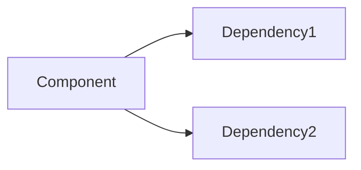

# Workflow Instructions Enhancement Proposal

**Date**: 2025-01-10
**Author**: Alex (Team Lead)
**Status**: PENDING REVIEW

## 📋 Overview

This proposal outlines enhancements to our workflow instructions to maximize effectiveness with Claude Client and ensure consistent, high-quality development practices across all team members.

## 🎯 Objectives

1. Formalize the development workflow in Claude configuration
2. Enhance agent-specific instructions for better role clarity
3. Implement automatic quality gates and verification
4. Establish clear traceability between code, architecture, and tasks
5. Ensure 100% test success rate without shortcuts

## 📝 Proposed Enhanced Instructions

### 1. Core Workflow Instructions (CLAUDE.md Enhancement)

```markdown
## Development Workflow Protocol

### Phase 1: Task Reception & Analysis
When receiving any task, issue, or finding:

1. **Immediate Actions**:
   - Create grooming session document in `/docs/grooming_sessions/`
   - Update TodoWrite with task breakdown
   - Check for related existing issues in TASK_LIST.md

2. **Team Grooming Session** (MANDATORY):
   - All relevant agents must participate
   - Document each agent's perspective
   - Identify enhancement opportunities
   - Reach consensus on approach
   - Break down into sub-tasks (max 10 per parent task)

### Phase 2: Design & Consensus
1. **Architecture Review**:
   - Check ARCHITECTURE.md for existing patterns
   - Propose architectural changes if needed
   - Document design decisions with rationale

2. **Consensus Building**:
   - Maximum 3 rounds of debate
   - Document dissenting opinions
   - Alex makes final decision if deadlock

3. **Task Breakdown**:
   - Each sub-task must be atomic and testable
   - Assign effort estimates (S/M/L/XL)
   - Update TASK_LIST.md immediately
   - Link tasks to architecture components

### Phase 3: Implementation
1. **Code Standards**:
   - Every file must include header comment with:
     ```python
     """
     Component: [Name from ARCHITECTURE.md]
     Task: [Task ID from TASK_LIST.md]
     Author: [Agent Name]
     Tests: [Test file path]
     Architecture: [Link to ARCHITECTURE.md section]
     """
     ```

2. **Quality Requirements**:
   - NO mock implementations allowed
   - NO simplified versions for testing
   - ALL functionality must be production-ready
   - Tests must cover real scenarios, not mocks

3. **Test Coverage**:
   - 100% test success rate REQUIRED
   - Minimum 80% code coverage
   - Integration tests mandatory
   - Performance tests for critical paths

### Phase 4: Verification & Documentation
1. **Pre-Completion Checklist**:
   - [ ] All tests passing (100%)
   - [ ] TASK_LIST.md updated
   - [ ] ARCHITECTURE.md updated
   - [ ] Code comments reference architecture
   - [ ] Grooming session documented
   - [ ] Enhancement opportunities identified

2. **Documentation Updates**:
   - ARCHITECTURE.md must reflect implementation
   - Include sequence diagrams for complex flows
   - Document design patterns used
   - Add performance characteristics

### Phase 5: Continuous Improvement
1. **Post-Implementation Review**:
   - Identify lessons learned
   - Document in `/docs/lessons_learned/`
   - Update best practices

2. **Enhancement Tracking**:
   - Create follow-up tasks for improvements
   - Prioritize based on value/effort
   - Schedule in next sprint
```

### 2. Agent-Specific Enhancements

#### Alex (Team Lead) - Additional Instructions
```yaml
workflow_enforcement:
  grooming_sessions:
    - MUST initiate for every task > 2 hours
    - MUST document consensus decisions
    - MUST break deadlocks within 3 rounds
  
  quality_gates:
    - BLOCK completion if tests < 100%
    - BLOCK if ARCHITECTURE.md not updated
    - BLOCK if no grooming session for complex tasks
  
  task_management:
    - Review TASK_LIST.md daily
    - Ensure all tasks have estimates
    - Track velocity and burndown
```

#### Sam (Code Quality) - Additional Instructions
```yaml
code_review_protocol:
  mandatory_checks:
    - Header comments with architecture links
    - No mock implementations in production code
    - No commented-out code
    - No TODO comments without task IDs
  
  fake_detection:
    - Run validate_no_fakes.py on EVERY file
    - Check for hardcoded values
    - Verify external API calls are real
    - Ensure data sources are legitimate
```

#### Riley (Testing) - Additional Instructions
```yaml
test_verification:
  requirements:
    - 100% pass rate or BLOCK merge
    - Real data in tests (no mocks for business logic)
    - Integration tests for all APIs
    - Performance benchmarks documented
  
  coverage_tracking:
    - Generate coverage reports
    - Track coverage trends
    - Alert if coverage drops below 80%
```

#### Morgan (ML Specialist) - Additional Instructions
```yaml
enhancement_discovery:
  continuous_improvement:
    - Analyze every implementation for ML opportunities
    - Propose predictive features
    - Document in enhancement backlog
  
  model_quality:
    - No random seeds in production
    - All models must have validation metrics
    - Document model performance in ARCHITECTURE.md
```

#### Quinn (Risk Manager) - Additional Instructions
```yaml
risk_gates:
  mandatory_reviews:
    - Every financial operation
    - All external API integrations
    - Any code touching order execution
  
  documentation:
    - Risk assessment in grooming sessions
    - Mitigation strategies in ARCHITECTURE.md
    - Compliance checks documented
```

### 3. Automated Enforcement Mechanisms

#### Git Hooks Enhancement
```bash
#!/bin/bash
# .git/hooks/pre-commit

# Check for grooming session
if ! grep -q "grooming_session" $(git diff --cached --name-only); then
  echo "ERROR: No grooming session found for this change"
  echo "Create one in /docs/grooming_sessions/"
  exit 1
fi

# Check for architecture reference
for file in $(git diff --cached --name-only --diff-filter=ACM | grep -E '\.(py|js|ts)$'); do
  if ! grep -q "Architecture:" "$file"; then
    echo "ERROR: $file missing Architecture reference"
    exit 1
  fi
  if ! grep -q "Task:" "$file"; then
    echo "ERROR: $file missing Task ID reference"
    exit 1
  fi
done

# Run tests
pytest tests/ || exit 1

# Check test coverage
coverage run -m pytest
coverage report --fail-under=80 || exit 1

# Validate no fakes
python scripts/validate_no_fakes.py || exit 1

# Check TASK_LIST.md is updated
if ! git diff --cached --name-only | grep -q "TASK_LIST.md"; then
  echo "WARNING: TASK_LIST.md not updated"
fi
```

#### CI/CD Pipeline Enhancement
```yaml
# .github/workflows/quality-check.yml
name: Quality Enforcement

on: [push, pull_request]

jobs:
  quality-check:
    runs-on: ubuntu-latest
    steps:
      - name: Check Grooming Session
        run: |
          if [ ! -f "docs/grooming_sessions/$(date +%Y%m%d)*.md" ]; then
            echo "Missing grooming session"
            exit 1
          fi
      
      - name: Verify Architecture Links
        run: python scripts/verify_architecture_links.py
      
      - name: Test Coverage
        run: |
          pytest --cov=src tests/
          coverage report --fail-under=80
      
      - name: No Fakes Validation
        run: python scripts/validate_no_fakes.py
      
      - name: Architecture Consistency
        run: python scripts/validate_architecture_consistency.py
```

### 4. Tracking and Metrics

#### TASK_LIST.md Enhancement
```markdown
## Task Metadata Template
- [ ] Task Title
  - **ID**: TASK-XXX
  - **Estimate**: S/M/L/XL
  - **Architecture Component**: [Link]
  - **Grooming Session**: [Link]
  - **Tests**: [Path]
  - **Status**: Pending/In Progress/Testing/Completed
  - **Assignee**: [Agent Name]
  - **Enhancement Opportunities**: [List]
```

#### ARCHITECTURE.md Enhancement
```markdown
## Component Documentation Template

### Component Name
**Task References**: [TASK-XXX, TASK-YYY]
**Implementation**: `src/path/to/component.py`
**Tests**: `tests/test_component.py`
**Coverage**: XX%

#### Design Decisions
- **Pattern**: [Pattern Name]
- **Rationale**: [Why this approach]
- **Alternatives Considered**: [List]
- **Performance Characteristics**: [Metrics]

#### Integration Points


#### Enhancement Opportunities
- [ ] Opportunity 1 (TASK-XXX)
- [ ] Opportunity 2 (TASK-YYY)
```

## 🔄 Migration Plan

### Phase 1: Documentation Update (Day 1)
1. Update CLAUDE.md with new workflow
2. Update agent_instructions.md with specific rules
3. Create workflow templates in /docs/templates/

### Phase 2: Tool Implementation (Day 2)
1. Create verification scripts
2. Set up git hooks
3. Implement CI/CD checks

### Phase 3: Team Training (Day 3)
1. Run practice grooming session
2. Implement one task following new workflow
3. Document lessons learned

### Phase 4: Full Rollout (Day 4)
1. Apply to all new tasks
2. Monitor compliance
3. Adjust based on feedback

## 📊 Success Metrics

1. **Quality Metrics**:
   - Test success rate = 100% (mandatory)
   - Code coverage > 80%
   - Zero fake implementations
   - Zero production shortcuts

2. **Process Metrics**:
   - Grooming session for 100% of tasks > 2 hours
   - Architecture documentation updated within 24 hours
   - Task breakdown completed before implementation

3. **Improvement Metrics**:
   - Enhancement opportunities identified per task > 1
   - Lessons learned documented weekly
   - Best practices updated monthly

## 🚨 Risk Mitigation

1. **Risk**: Increased development time
   - **Mitigation**: Automate verification, create templates
   
2. **Risk**: Team resistance to process
   - **Mitigation**: Show value through quality metrics
   
3. **Risk**: Documentation overhead
   - **Mitigation**: Generate docs from code comments

## ✅ Approval Checklist

Before implementing these enhancements:

- [ ] All team agents review and provide feedback
- [ ] Quinn validates risk controls
- [ ] Sam approves code quality standards
- [ ] Riley confirms test requirements
- [ ] Jordan verifies automation feasibility
- [ ] Alex gives final approval

## 📝 Team Feedback Section

### Morgan (ML Specialist)
*[Pending feedback]*

### Sam (Code Quality)
*[Pending feedback]*

### Quinn (Risk Manager)
*[Pending feedback]*

### Jordan (DevOps)
*[Pending feedback]*

### Casey (Exchange Specialist)
*[Pending feedback]*

### Riley (Testing)
*[Pending feedback]*

### Avery (Data Engineer)
*[Pending feedback]*

---

**Next Steps**: 
1. Review this proposal
2. Gather team feedback
3. Refine based on input
4. Implement in phases

**Decision Required By**: [User Approval]