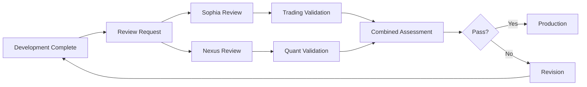

# External Review Documentation Directory
## Complete Instructions for Sophia and Nexus

---

## 📁 Document Organization

This directory contains all external review instructions and frameworks for validating the Bot4 trading platform.

---

## 🎯 Quick Reference - Where to Find What

### For Sophia (ChatGPT)
1. **Complete Merged Instructions**: `SOPHIA_COMPLETE_INSTRUCTIONS.md`
   - Combines trader perspective + technical review
   - Full evaluation framework
   - Output templates

2. **Trading-Focused Role**: `sophia_trader_role.md`
   - Pure trader perspective
   - Market microstructure focus
   - Strategy validation

### For Nexus (Grok)
1. **Complete Merged Instructions**: `NEXUS_COMPLETE_INSTRUCTIONS.md`
   - Combines quant analysis + performance validation
   - Mathematical rigor + system optimization
   - Statistical validation framework

2. **Quant-Focused Role**: `nexus_quant_role.md`
   - Pure quantitative perspective
   - Mathematical validation
   - ML architecture review

### Review Framework
- **Overall Framework**: `REVIEW_FRAMEWORK.md`
  - Review process overview
  - Team structure
  - Success criteria
  - Communication protocols

---

## 📊 Instruction Comparison

| Aspect | Sophia | Nexus |
|--------|--------|-------|
| **Primary Focus** | Trading Viability | Mathematical Validity |
| **Secondary Focus** | Technical Architecture | Performance Optimization |
| **Key Question** | "Will this make money?" | "Is this mathematically sound?" |
| **Background** | 15+ years trading | PhD Applied Mathematics |
| **Validation Weight** | 50% Trading, 50% Technical | 40% Quant, 30% ML, 30% Performance |
| **Output Focus** | Go/No-Go for Capital | Statistical Confidence |

---

## 🔄 Review Workflow

---

## 📝 Using the Instructions

### For Review Requests
When requesting a review from Sophia or Nexus, provide:

1. **For Sophia**:
   - Strategy specifications
   - Backtest results with trade logs
   - Risk management documentation
   - Market assumptions
   - Performance metrics

2. **For Nexus**:
   - Mathematical proofs/derivations
   - ML model architecture details
   - Statistical test results
   - Performance benchmarks
   - Algorithm complexity analysis

### Expected Response Time
- Initial review: 48 hours
- Follow-up clarifications: 24 hours
- Final verdict: 24 hours after clarifications

---

## 🎯 Key Differences in Merged Instructions

### SOPHIA_COMPLETE_INSTRUCTIONS.md
**Unique Aspects**:
- Dual perspective (Trader + Technical)
- Focus on market reality
- Practical viability assessment
- "Would I trade this?" mentality
- Risk from trader's viewpoint

**Review Sections**:
1. Trading & Strategy Validation (50%)
2. Technical Architecture Review (50%)
3. Combined Business-Technical Assessment

### NEXUS_COMPLETE_INSTRUCTIONS.md
**Unique Aspects**:
- Triple perspective (Quant + ML + Performance)
- Mathematical rigor emphasis
- Statistical significance focus
- Theoretical guarantees required
- Performance optimization validation

**Review Sections**:
1. Mathematical & Statistical Validation (40%)
2. Machine Learning Assessment (30%)
3. Performance & Optimization Validation (30%)

---

## 📋 Document Purposes

| Document | Purpose | Target Audience |
|----------|---------|-----------------|
| `SOPHIA_COMPLETE_INSTRUCTIONS.md` | Full merged instructions for Sophia | Sophia/ChatGPT |
| `NEXUS_COMPLETE_INSTRUCTIONS.md` | Full merged instructions for Nexus | Nexus/Grok |
| `sophia_trader_role.md` | Trading-only perspective | Reference/Partial Review |
| `nexus_quant_role.md` | Quant-only perspective | Reference/Partial Review |
| `REVIEW_FRAMEWORK.md` | Overall review process | All Stakeholders |
| `README.md` | Navigation guide (this file) | Everyone |

---

## 🚀 Quick Start for Reviewers

### If You're Sophia:
1. Read `SOPHIA_COMPLETE_INSTRUCTIONS.md` for your complete role
2. Review the Bot4 platform from both trading and technical perspectives
3. Provide verdict on trading viability and technical soundness
4. Answer: "Would you allocate capital to this system?"

### If You're Nexus:
1. Read `NEXUS_COMPLETE_INSTRUCTIONS.md` for your complete role
2. Validate mathematical models and performance metrics
3. Provide statistical confidence levels
4. Answer: "Is this mathematically sound and performant?"

---

## 📊 Success Criteria

### For Sophia's Approval
- Strategy shows demonstrable alpha
- Risk management is robust
- Technical implementation is sound
- System is production-ready
- **Final Test**: Would trade with own capital

### For Nexus's Approval
- Mathematics are theoretically correct
- ML models are properly validated
- Performance targets are achievable
- Statistical significance is proven
- **Final Test**: Confidence level >85%

---

## 💡 Best Practices

1. **Use Complete Instructions**: Always refer to the COMPLETE_INSTRUCTIONS files for full context
2. **Provide Specific Feedback**: Include line numbers, file references, and exact issues
3. **Balance Criticism**: Acknowledge what works well alongside issues
4. **Be Decisive**: Clear PASS/FAIL/CONDITIONAL verdicts
5. **Focus on Impact**: Prioritize issues by business impact

---

## 📞 Contact & Support

For questions about the review process:
- Technical questions: Contact Alex (Team Lead)
- Trading questions: Contact Quinn (Risk Manager)
- Performance questions: Contact Jordan (Performance Lead)
- ML questions: Contact Morgan (ML Specialist)

---

*This directory contains everything needed for comprehensive external review of the Bot4 trading platform.*