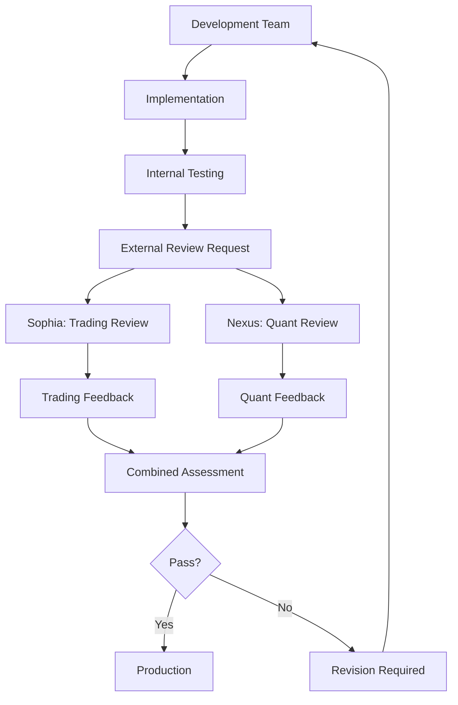

# External Review Framework
## Enhanced Validation with Trading & Quantitative Perspectives
## Date: 2025-08-17

---

## Overview

We've transformed our external review process from technical code validation to comprehensive business validation. External reviewers now evaluate the Bot4 trading platform from practitioner perspectives.

---

## Review Team Structure

### Internal Development Team (8 Agents)
Technical implementation and system development

### External Review Team (2 Specialists)
Business validation and trading viability assessment

---

## External Reviewer Roles

### 1. Sophia (ChatGPT) - Senior Trader & Strategy Validator

**Background**: 15+ years trading experience, $500M+ portfolio management

**Review Focus**:
- **Strategy Viability**: Can this actually achieve 200-300% APY?
- **Market Microstructure**: Does it understand real market dynamics?
- **Risk Management**: Are the risk controls practical?
- **Execution Quality**: Will orders execute efficiently?

**Key Questions**:
- "Where's the alpha?"
- "How does this handle market impact?"
- "What happens during a flash crash?"
- "Would I trade my own money with this?"

**Deliverables**:
- Trading strategy validation report
- Risk assessment from practitioner view
- Execution quality evaluation
- Go/No-go recommendation for production trading

---

### 2. Nexus (Grok) - Quantitative Analyst & ML Specialist

**Background**: PhD Applied Mathematics, 10+ years at top hedge funds

**Review Focus**:
- **Mathematical Validation**: Are all models theoretically sound?
- **ML Architecture**: Is the machine learning properly designed?
- **Statistical Rigor**: Are results statistically significant?
- **Risk Mathematics**: Are risk calculations correct?

**Key Questions**:
- "What are the mathematical assumptions?"
- "Is this statistically significant?"
- "Where are the error bounds?"
- "What's the theoretical guarantee?"

**Deliverables**:
- Mathematical model validation report
- ML architecture assessment
- Statistical significance analysis
- Quantitative recommendations

---

## Review Process

### Phase 1: Strategy Review (Sophia)
```yaml
week_1:
  - Review trading strategies for market viability
  - Assess risk management from trader perspective
  - Evaluate execution quality and slippage
  - Check for market microstructure understanding
```

### Phase 2: Quantitative Review (Nexus)
```yaml
week_1:
  - Validate mathematical models
  - Review ML training methodology
  - Check statistical significance
  - Verify risk calculations
```

### Phase 3: Combined Assessment
```yaml
week_2:
  - Reconcile trader and quant perspectives
  - Identify critical gaps
  - Provide unified recommendations
  - Final go/no-go decision
```

---

## Review Criteria

### Sophia's Trading Criteria
| Aspect | Weight | Pass Threshold |
|--------|--------|----------------|
| Strategy Alpha | 30% | Demonstrable edge |
| Risk Management | 25% | Multiple fail-safes |
| Execution Quality | 20% | <2% slippage |
| Market Awareness | 15% | Handles all regimes |
| Practical Viability | 10% | Production ready |

### Nexus's Quantitative Criteria
| Aspect | Weight | Pass Threshold |
|--------|--------|----------------|
| Mathematical Rigor | 30% | No theoretical flaws |
| Statistical Validity | 25% | p < 0.05 significance |
| ML Robustness | 20% | No overfitting |
| Risk Mathematics | 15% | Correct calculations |
| Performance Metrics | 10% | Sharpe > 2.0 |

---

## Integration with Development

### How Reviews Impact Development



### Review Triggers
- Phase completion
- Major strategy changes
- Risk model updates
- ML model retraining
- Performance degradation

---

## Expected Outcomes

### From Sophia
```markdown
Trading Validation Report:
- Strategy viability: PASS/FAIL
- Risk assessment: ACCEPTABLE/CONCERNING
- Execution quality: PROFESSIONAL/NEEDS_WORK
- Market readiness: YES/NO
- Capital allocation recommendation: $X
```

### From Nexus
```markdown
Quantitative Validation Report:
- Mathematical soundness: VALID/INVALID
- Statistical significance: PROVEN/UNPROVEN
- ML robustness: SOLID/VULNERABLE
- Risk calculations: CORRECT/FLAWED
- Confidence level: XX%
```

---

## Review Artifacts

### Documentation Required for Review
1. Strategy specifications
2. Backtest results with statistics
3. Risk management documentation
4. ML model architecture
5. Performance metrics
6. Mathematical proofs/derivations

### Expected Review Outputs
1. Validation reports (pass/fail/conditional)
2. Specific issues identified
3. Recommendations for improvement
4. Risk assessments
5. Performance projections
6. Implementation priorities

---

## Success Metrics

### Review Process Success
- **Completeness**: All aspects reviewed
- **Timeliness**: Reviews within 48 hours
- **Actionability**: Clear, specific feedback
- **Independence**: Unbiased assessment
- **Rigor**: Thorough validation

### Platform Success (Post-Review)
- **Trading**: Profitable in real markets
- **Risk**: Drawdowns within limits
- **Performance**: Meets latency targets
- **Reliability**: 99.99% uptime
- **Compliance**: Regulatory approved

---

## Review Communication

### Request Format
```yaml
review_request:
  to: [Sophia|Nexus]
  subject: Phase X Review - [Component]
  artifacts:
    - specification_docs
    - performance_metrics
    - test_results
  specific_questions:
    - [Targeted validation questions]
  timeline: 48 hours
```

### Response Format
```yaml
review_response:
  from: [Sophia|Nexus]
  verdict: [PASS|FAIL|CONDITIONAL]
  critical_issues: []
  recommendations: []
  confidence: XX%
  follow_up_required: [Yes|No]
```

---

## Continuous Improvement

### Feedback Loop
1. Reviews identify gaps
2. Development team addresses issues
3. Re-review validates fixes
4. Lessons learned documented
5. Process improvements implemented

### Review Evolution
- Quarterly review process assessment
- Criteria updates based on market changes
- New reviewer onboarding as needed
- Knowledge base maintenance
- Best practices documentation

---

## Conclusion

This enhanced review framework ensures Bot4 is validated not just technically, but from real-world trading and quantitative perspectives. By having Sophia validate trading viability and Nexus verify mathematical rigor, we ensure the platform can actually deliver its promised returns in production.

---

*The combination of practitioner wisdom and mathematical rigor provides comprehensive validation for production trading.*