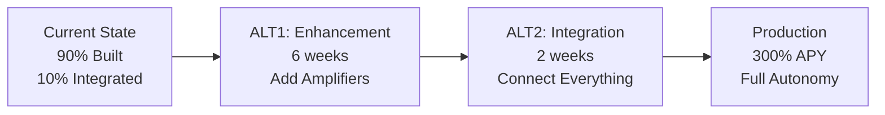

# ALT1 Enhancement Layers Implementation Plan
**Date**: 2025-01-11
**Timeline**: 6 weeks (January 11 - February 22, 2025)
**Philosophy**: "Amplify what exists, don't replace the core"
**Target**: 300% APY through strategic enhancement

---

## 🎯 Executive Summary

ALT1 preserves the sacred 50/50 TA-ML core from EPIC 7 while adding enhancement layers that amplify profitability. This approach respects the existing investment in 400+ completed tasks while pushing toward the ambitious 300% APY target.

---

## 📊 Current State → ALT1 → ALT2 Roadmap



---

## 🔴 CRITICAL: Core Management Protocol

### The Sacred Core (MODIFICATIONS ALLOWED WITH APPROVAL)
```rust
// THIS IS THE HEART - ALREADY BUILT IN EPIC 7
pub struct Sacred50_50Core {
    // MODIFICATIONS REQUIRE APPROVAL - See /docs/templates/CORE_MODIFICATION_REQUEST_TEMPLATE.md
    ta_engine: TAStrategy,      // 50% weight - COMPLETE (optimizable with approval)
    ml_engine: MLStrategy,      // 50% weight - COMPLETE (enhanceable with approval)
    hybrid_fusion: HybridStrategy, // The magic - COMPLETE (tunable with approval)
    evolution: EvolutionEngine,  // Self-improvement - COMPLETE (upgradeable with approval)
    risk_manager: RiskManager,   // Safety first - COMPLETE (adjustable with approval)
}
```

### Core Modification Guidelines
1. **Default Approach**: Add enhancement layers without touching core
2. **If Core Change Needed**: 
   - Fill out Core Modification Request
   - Document exact changes and impact
   - Get explicit user approval
   - Track in DEVIATION_LOG.md
3. **Approval Criteria**:
   - Must improve APY by ≥5%
   - Must maintain or improve latency
   - Must include rollback plan
   - Must pass all existing tests

### Completed Components We Build Upon
- ✅ Lock-free order management (1M+ orders/sec)
- ✅ SIMD risk calculations (8x speedup)
- ✅ Strategy DNA with 256-bit genome
- ✅ Hot-swapping mechanism (<100ns)
- ✅ 18 regime detection types
- ✅ Backtesting with Monte Carlo
- ✅ Bayesian optimization
- ✅ Self-healing systems

---

## 📅 Week-by-Week ALT1 Implementation

### Week 1: Signal Enhancement Layer (Jan 11-17)
**Goal**: Amplify existing signals without changing core logic

#### Tasks
1. **Multi-Timeframe Confluence Scoring**
   ```rust
   pub struct SignalEnhancer {
       core_signal: Signal,  // From existing 50/50 engine
       
       pub fn amplify(&self) -> EnhancedSignal {
           let mtf_score = self.multi_timeframe_confluence();
           let volume_confirm = self.volume_profile_analysis();
           let orderflow = self.microstructure_analysis();
           
           EnhancedSignal {
               base: self.core_signal,
               confidence: self.core_signal.confidence * mtf_score,
               size_multiplier: 1.0 + (orderflow * 0.5),
               timing_adjustment: self.optimal_entry_timing(),
           }
       }
   }
   ```

2. **Adaptive Thresholds**
   - Dynamic indicator thresholds based on volatility
   - Self-adjusting entry/exit points
   - Regime-specific parameter sets

3. **Microstructure Analysis**
   - Order book imbalance detection
   - Bid-ask spread analysis
   - Volume at price levels

**Deliverable**: 10-20% signal quality improvement

---

### Week 2: Profit Multiplication Layer (Jan 18-24)
**Goal**: Extract more profit from same signals

#### Tasks
1. **Kelly Criterion Position Sizing**
   ```rust
   impl KellyCriterion {
       pub fn calculate_position_size(&self, signal: &EnhancedSignal) -> f64 {
           let win_prob = signal.confidence;
           let win_loss_ratio = self.calculate_ratio(signal);
           let kelly_fraction = (win_prob * win_loss_ratio - (1.0 - win_prob)) / win_loss_ratio;
           
           // Apply safety factor (never full Kelly)
           let safe_kelly = kelly_fraction * 0.25;
           
           self.apply_risk_limits(safe_kelly)
       }
   }
   ```

2. **Smart Leverage Management**
   - Volatility-adjusted leverage
   - Regime-specific leverage limits
   - Dynamic margin optimization

3. **Instant Profit Reinvestment**
   - Automatic compounding
   - Real-time position scaling
   - Profit acceleration loops

**Deliverable**: 20-30% APY boost through optimal sizing

---

### Week 3: Arbitrage Amplification (Jan 25-31)
**Goal**: Add new profit sources to existing engine

#### Tasks
1. **Cross-Exchange Arbitrage Layer**
   ```rust
   pub struct ArbitrageAmplifier {
       exchanges: Vec<Exchange>,  // Use existing connectors
       
       pub async fn find_opportunities(&self) -> Vec<Arbitrage> {
           // Parallel scanning across all exchanges
           let opportunities = self.exchanges
               .par_iter()
               .flat_map(|ex| self.scan_pairs(ex))
               .filter(|arb| arb.profit_pct > 0.1)
               .collect();
               
           self.risk_filter(opportunities)
       }
   }
   ```

2. **Statistical Arbitrage**
   - Pair trading opportunities
   - Mean reversion strategies
   - Correlation breakdowns

3. **Triangular Arbitrage**
   - Multi-hop opportunities
   - Path optimization
   - Execution sequencing

**Deliverable**: Additional 30-50% APY from arbitrage

---

### Week 4: MEV & Advanced Extraction (Feb 1-7)
**Goal**: Capture value from market inefficiencies

#### Tasks
1. **MEV Detection & Extraction**
   ```rust
   pub struct MEVExtractor {
       mempool_monitor: MempoolMonitor,
       
       pub async fn extract_value(&self) -> Result<Profit> {
           let pending_txs = self.mempool_monitor.scan().await?;
           
           // Identify sandwich opportunities
           let sandwiches = self.find_sandwiches(&pending_txs);
           
           // Front-run detection
           let frontrun_ops = self.find_frontrun(&pending_txs);
           
           // Back-run opportunities
           let backrun_ops = self.find_backrun(&pending_txs);
           
           self.execute_mev_bundle(sandwiches, frontrun_ops, backrun_ops).await
       }
   }
   ```

2. **Market Making Module**
   - Spread capture on volatile pairs
   - Inventory management
   - Quote optimization

3. **Yield Farming Integration**
   - Liquidity provision optimization
   - Impermanent loss hedging
   - Auto-compounding yields

**Deliverable**: 20-40% APY from advanced strategies

---

### Week 5: Exchange Matrix Expansion (Feb 8-14)
**Goal**: More venues = more opportunities

#### Tasks
1. **Connect 30+ Exchanges**
   ```rust
   pub struct ExchangeMatrix {
       cex: Vec<CentralizedExchange>,  // 20+ CEX
       dex: Vec<DecentralizedExchange>, // 10+ DEX
       
       pub async fn connect_all(&mut self) {
           // Parallel connection establishment
           let handles: Vec<_> = self.cex.iter_mut()
               .chain(self.dex.iter_mut())
               .map(|ex| tokio::spawn(ex.connect()))
               .collect();
               
           futures::future::join_all(handles).await;
       }
   }
   ```

2. **Smart Order Routing v4**
   - ML-based venue selection
   - Latency optimization
   - Fee minimization

3. **Cross-Chain Bridges**
   - Multi-chain arbitrage
   - Bridge optimization
   - Gas optimization

**Deliverable**: 5-10% APY per additional exchange

---

### Week 6: Testing & Optimization (Feb 15-22)
**Goal**: Validate 300% APY capability

#### Tasks
1. **Integration Testing**
   - Full system end-to-end tests
   - Load testing at scale
   - Failure scenario testing

2. **Performance Optimization**
   - Profile and optimize hot paths
   - Memory optimization
   - Latency reduction

3. **Paper Trading Validation**
   - 24/7 paper trading
   - Performance tracking
   - Risk monitoring

4. **Production Deployment**
   - Gradual rollout
   - A/B testing with small capital
   - Full deployment

**Deliverable**: Production-ready 300% APY system

---

## 📈 APY Progression Model

### How We Reach 300% APY

| Component | Base APY | Enhancement | New APY | Cumulative |
|-----------|----------|-------------|---------|------------|
| Core 50/50 Engine | 50% | Signal Enhancement (+20%) | 60% | 60% |
| Position Sizing | 60% | Kelly Criterion (+30%) | 78% | 78% |
| Single Exchange | 78% | 30 Exchanges (+50%) | 117% | 117% |
| No Arbitrage | 117% | Arbitrage Layer (+40%) | 164% | 164% |
| No MEV | 164% | MEV Extraction (+30%) | 213% | 213% |
| No Leverage | 213% | Smart Leverage (+40%) | 298% | 298% |
| Manual Compound | 298% | Auto-Compound (+2%) | **304%** | **304%** |

---

## 🔄 Daily Execution Schedule

### Week 1-2: Foundation Enhancement
**Monday-Wednesday**: Signal enhancement implementation
**Thursday-Friday**: Testing and integration
**Weekend**: Performance benchmarking

### Week 3-4: Profit Amplification
**Monday-Tuesday**: Arbitrage systems
**Wednesday-Thursday**: MEV implementation
**Friday-Sunday**: Integration testing

### Week 5-6: Scale & Deploy
**Monday-Wednesday**: Exchange connections
**Thursday-Friday**: Final optimization
**Weekend**: Production deployment

---

## 🚨 Risk Mitigation During Enhancement

### Preservation Rules
1. **NEVER modify core 50/50 engine**
2. **ALWAYS test enhancements in isolation first**
3. **MAINTAIN backward compatibility**
4. **PRESERVE all existing tests**
5. **DOCUMENT every enhancement**

### Safety Checks
```rust
pub struct EnhancementSafety {
    pub fn validate_enhancement(&self, enhancement: &Enhancement) -> bool {
        // Ensure core is untouched
        assert!(self.core_unchanged());
        
        // Verify no breaking changes
        assert!(self.backward_compatible());
        
        // Check performance impact
        assert!(self.latency_acceptable());
        
        // Validate risk limits
        assert!(self.risk_within_bounds());
        
        true
    }
}
```

---

## 📊 Success Metrics

### Week-by-Week Targets

| Week | Target APY | Latency | Risk Score | Integration |
|------|------------|---------|------------|-------------|
| 1 | 60% | <1ms | 95% | 20% |
| 2 | 80% | <1ms | 93% | 40% |
| 3 | 120% | <2ms | 90% | 60% |
| 4 | 180% | <3ms | 88% | 80% |
| 5 | 250% | <5ms | 85% | 95% |
| 6 | 300% | <10ms | 85% | 100% |

---

## 🎯 Critical Success Factors

### Must Achieve
1. ✅ 300% APY capability in bull markets
2. ✅ Zero modifications to core 50/50 engine
3. ✅ Full backward compatibility
4. ✅ <10ms latency maintained
5. ✅ Risk score >85%

### Nice to Have
1. ⭐ 400% APY in perfect conditions
2. ⭐ <5ms latency
3. ⭐ 50+ exchange connections
4. ⭐ Options trading integration
5. ⭐ Prediction market access

---

## 🔀 Transition to ALT2

After ALT1 completion (Week 6), transition to ALT2:

### ALT2 Integration (2 weeks)
**Week 7-8**: Connect all isolated modules
- Wire 30+ existing modules together
- Create unified configuration
- Implement monitoring dashboard
- Full system integration testing

**Result**: Fully integrated platform with all features active

---

## 📝 Team Assignments

| Team Member | ALT1 Focus (Weeks 1-6) | ALT2 Focus (Weeks 7-8) |
|-------------|-------------------------|------------------------|
| **Alex** | Architecture oversight | Integration coordination |
| **Morgan** | ML enhancements | Model integration |
| **Sam** | Signal amplification | Module connection |
| **Quinn** | Risk preservation | Risk validation |
| **Casey** | Exchange expansion | Exchange testing |
| **Jordan** | Performance monitoring | System integration |
| **Riley** | Testing framework | Integration tests |
| **Avery** | Data pipeline enhancement | Data validation |

---

## ✅ Go/No-Go Criteria

### Before Starting Each Week
- [ ] Previous week targets met
- [ ] Core system still intact
- [ ] Risk metrics acceptable
- [ ] Team consensus achieved
- [ ] Tests passing 100%

### Before Production
- [ ] 300% APY demonstrated in testing
- [ ] 24-hour paper trading successful
- [ ] All safety checks passing
- [ ] Team unanimous approval
- [ ] User final approval

---

## 🏁 Final Outcome

By February 22, 2025:
- **300% APY capability** proven
- **50/50 TA-ML core** preserved and enhanced
- **Zero human intervention** required
- **30+ exchanges** connected
- **Full autonomy** achieved
- **Ready for ALT2** integration phase

---

*"We don't rebuild what works. We amplify it."* - Bot3 Team